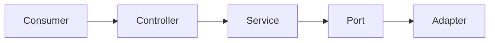
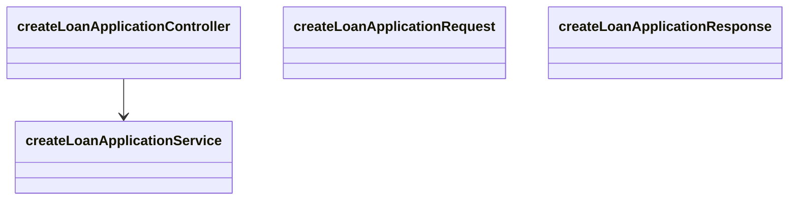
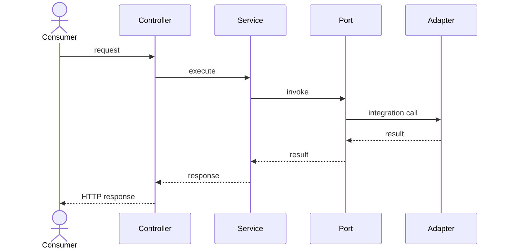
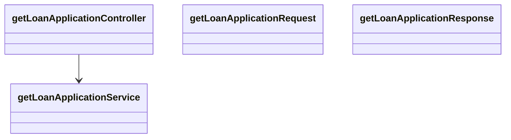
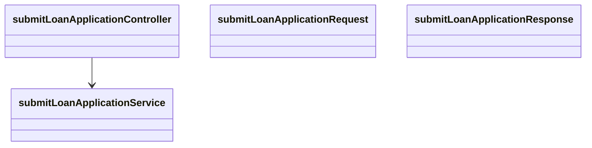
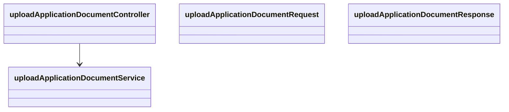
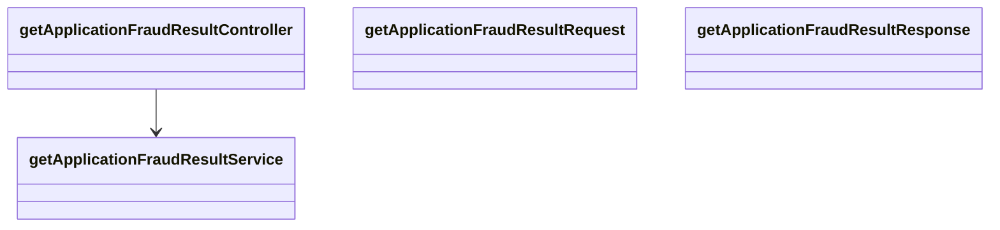
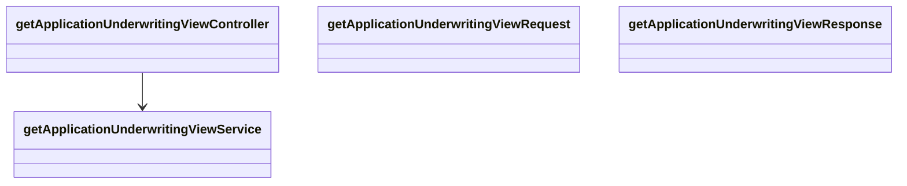

# Digital Loan Origination — Applicant Self-Service Enhancement

## Summary
Provide online loan application submission, save/resume, supporting document upload, real-time applicant status tracking, automated status notifications, automated credit and fraud checks, and consolidated underwriting decision support, integrated securely with existing bank and vendor systems.

## Overall component diagram


## Endpoint 1: POST /v1/applications

### Class diagram


### Sequence diagram


## Endpoint 2: PATCH /v1/applications/{applicationId}

### Class diagram


### Sequence diagram


## Endpoint 3: GET /v1/applications/{applicationId}

### Class diagram


### Sequence diagram


## Endpoint 4: POST /v1/applications/{applicationId}/submission

### Class diagram


### Sequence diagram


## Endpoint 5: POST /v1/applications/{applicationId}/documents

### Class diagram


### Sequence diagram


## Endpoint 6: GET /v1/applications/{applicationId}/status

### Class diagram


### Sequence diagram


## Endpoint 7: GET /v1/applications/{applicationId}/credit-result

### Class diagram


### Sequence diagram


## Endpoint 8: GET /v1/applications/{applicationId}/fraud-result

### Class diagram


### Sequence diagram


## Endpoint 9: GET /v1/applications/{applicationId}/underwriting

### Class diagram


### Sequence diagram


## Endpoint 10: POST /v1/applications/{applicationId}/decision

### Class diagram


### Sequence diagram
```mermaid
sequenceDiagram
 actor Consumer
 Consumer->>Controller: request
 Controller->>Service: execute
 Service->>Port: invoke
 Port->>Adapter: integration call
 Adapter-->>Port: result
 Port-->>Service: result
 Service-->>Controller: response
 Controller-->>Consumer: HTTP response
```

## Assumptions
- The Core Banking Platform REST APIs used for loan account creation and balance and terms lookup are stable and require no modification, as stated in the requirement.
- The Credit Bureau Service and Fraud Detection Service can handle the required production call volumes without new vendor contracts, as stated in the requirement.
- Marketing will provide the email and SMS notification templates before implementation of status-change notifications.
- The status values explicitly listed in scope—submitted, under review, approved, declined, and funded—are the applicant-visible tracking states for this phase.
- Moderate field mapping and enrichment between core banking data and credit/fraud service formats is sufficient; no multi-schema canonical data model is assumed.

## Risks
- Peak concurrent applicant volume is unspecified, so capacity requirements for application submission, document upload, status retrieval, Kafka processing, and downstream calls cannot yet be sized confidently.
- The storage destination for applicant documents is unresolved between the existing Document Management System and a new object store, affecting encryption, retrieval, and service integration design.
- The requirement does not resolve whether fraud screening blocks submission synchronously or runs asynchronously after submission, which can materially alter submission latency and workflow semantics.
- Every status change requires both email and SMS delivery, so outages or lag in the event-driven notification path could cause delayed applicant communications.
- Credit bureau data requires audit logging, creating compliance risk if underwriter retrieval paths or downstream credit accesses are implemented without complete audit coverage.

## Dependencies
- Core Banking Platform REST availability and OAuth 2.0 client-credentials access are required for loan account creation and balance and terms lookup.
- Credit Bureau Service availability and OAuth 2.0 client-credentials access are required to automatically pull a credit report after application submission.
- Fraud Detection Service and the fraud-check-completed event flow are required to provide fraud risk results before final approval.
- The SMS / Email Gateway and notification-delivery-requested event flow are required to send both notification channels on application status changes.
- Kafka infrastructure is required for application-status-changed, fraud-check-completed, and notification-delivery-requested topics.
- A document storage decision and corresponding secure storage integration are required to satisfy document upload and PII encryption-at-rest requirements.

## In scope
- Applicant creation, saving, resumption, and submission of an online loan application.
- Applicant upload of pay stubs, identification, and proof-of-address supporting documents with encryption in transit and at rest.
- Applicant retrieval of real-time status across submitted, under review, approved, declined, and funded states.
- Automatic credit report retrieval after application submission and fraud screening before underwriting or final approval as described in the requirement.
- Underwriter access to consolidated credit and fraud results and recording of approve or decline decisions.
- Email and SMS notifications for every application status change and an operations alert for high-risk fraud results.
- Secure service-to-service integrations using OAuth 2.0 client credentials and Kafka-based event processing.

## Out of scope
- Co-branded partner lending is explicitly excluded from this phase.
- International applicants are explicitly excluded from this phase.
- Manual underwriting override workflows are explicitly deferred to phase 2.
- Complex canonicalization across multiple disparate external schemas is explicitly not anticipated for this phase.
- Modification of existing Core Banking Platform REST APIs is not included because the requirement assumes those APIs are stable.

## Ambiguities
- The architecture overview estimates approximately 12 REST endpoints but does not specify their exact contracts; only endpoints directly supported by stated applicant, document, status, result retrieval, and decisioning capabilities can be justified from the requirement.
- The loan application form fields, validation rules, loan product fields, requested amount, terms, and applicant identity attributes are not defined, preventing a complete request schema for application creation or updates.
- It is unresolved whether uploaded documents will be stored in the existing Document Management System or a new object store.
- The requirement does not define the expected peak concurrent applicant volume during launch.
- It is unresolved whether fraud screening must block application submission synchronously or run asynchronously after submission.
- The requirement says fraud screening occurs before an application reaches underwriting and also describes fraud scoring before final approval, leaving the exact workflow gate unclear.
- The full fraud-risk vocabulary and threshold constituting high-risk are not specified.
- Authentication and authorization mechanisms for applicant-facing and underwriter-facing API calls are not specified; OAuth 2.0 client credentials is stated only for service-to-service calls.
- The mechanism, recipients, and delivery channel for the operations-team high-risk fraud alert are not specified.
- The exact point at which an approved loan becomes funded and how Core Banking Platform loan account creation drives that status transition are not defined.
- The requirement mandates notifications on every status change but does not specify retry, deduplication, ordering, or failed-delivery behavior for Kafka events or the SMS / Email Gateway.
