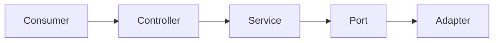
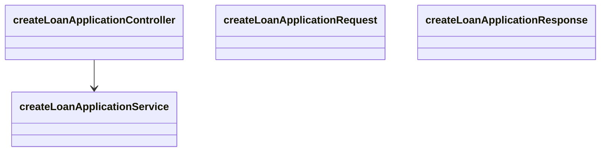
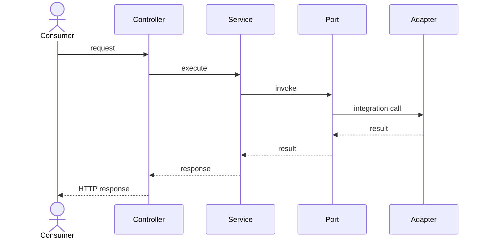
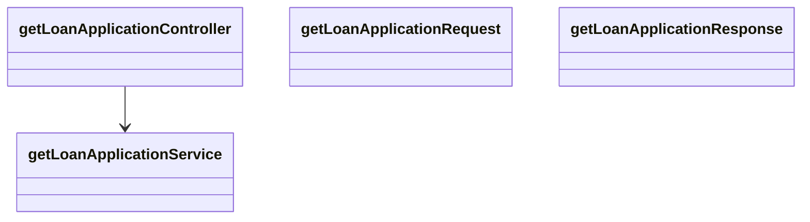
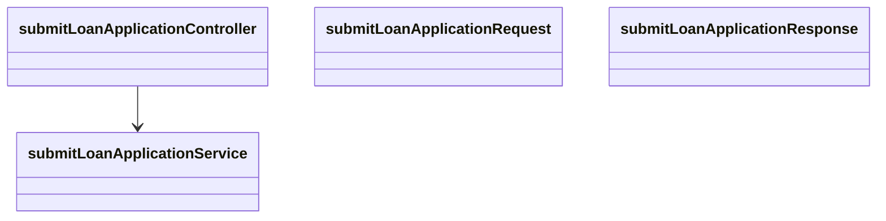
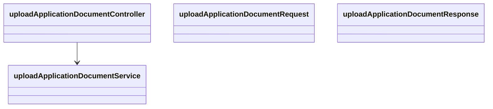
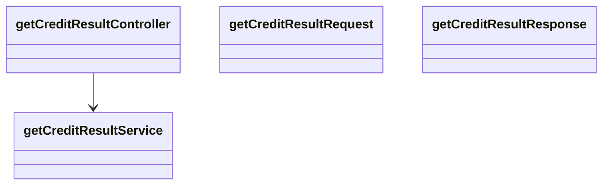
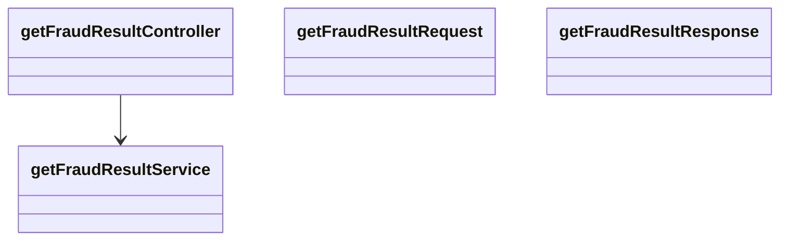
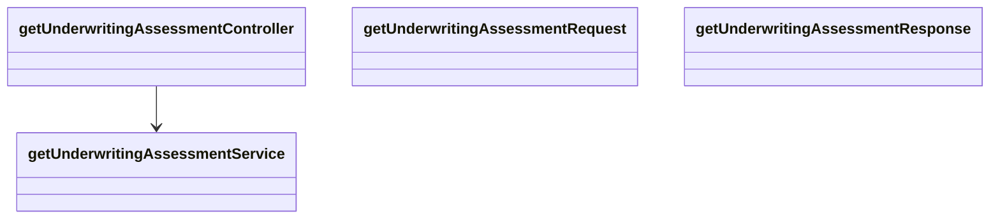
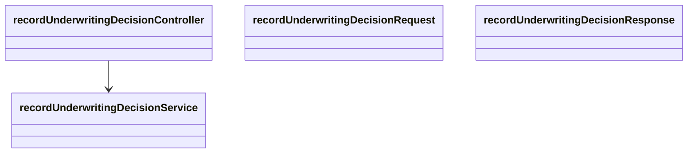

# Digital Loan Origination — Applicant Self-Service Enhancement

## Summary
Applicant self-service loan origination supporting application creation, save/resume, submission, supporting document upload, real-time status retrieval, automated credit and fraud screening, underwriter review and decisioning, and status-driven notifications. The solution integrates with existing bank and external services and uses Kafka for specified event-driven processing.

## Overall component diagram


## Endpoint 1: POST /applications

### Class diagram


### Sequence diagram


## Endpoint 2: GET /applications/{applicationId}

### Class diagram


### Sequence diagram


## Endpoint 3: PATCH /applications/{applicationId}

### Class diagram


### Sequence diagram


## Endpoint 4: POST /applications/{applicationId}/submission

### Class diagram


### Sequence diagram


## Endpoint 5: POST /applications/{applicationId}/documents

### Class diagram


### Sequence diagram


## Endpoint 6: GET /applications/{applicationId}/status

### Class diagram


### Sequence diagram


## Endpoint 7: GET /applications/{applicationId}/credit-result

### Class diagram


### Sequence diagram


## Endpoint 8: GET /applications/{applicationId}/fraud-result

### Class diagram


### Sequence diagram


## Endpoint 9: GET /applications/{applicationId}/underwriting-assessment

### Class diagram


### Sequence diagram


## Endpoint 10: POST /applications/{applicationId}/decision

### Class diagram


### Sequence diagram
```mermaid
sequenceDiagram
 actor Consumer
 Consumer->>Controller: request
 Controller->>Service: execute
 Service->>Port: invoke
 Port->>Adapter: integration call
 Adapter-->>Port: result
 Port-->>Service: result
 Service-->>Controller: response
 Controller-->>Consumer: HTTP response
```

## Assumptions
- The Core Banking Platform's existing REST APIs are stable and require no modification.
- The Credit Bureau Service and Fraud Detection Service can support required call volumes without new contracts.
- Notification templates will be supplied by the marketing team before development.
- Detailed applicant data fields are not inferred because the requirement does not define the application data schema.
- The stated approximately 12 REST endpoints is an estimate rather than a requirement to invent endpoints; only endpoints justified by explicit functional requirements are included.

## Risks
- The document storage architecture is unresolved between the existing Document Management System and a new object store.
- Peak concurrent applicant volume is unknown, preventing confirmed capacity and scalability sizing.
- The required timing of fraud screening relative to submission is unresolved.
- Applicant and loan data require field mapping and enrichment between the Core Banking Platform and credit/fraud service schemas.
- Notification delivery depends on externally supplied email and SMS templates.

## Dependencies
- Core Banking Platform
- Credit Bureau Service
- Fraud Detection Service
- SMS / Email Gateway
- Document Management System or a yet-to-be-selected object store
- Apache Kafka event-driven layer
- Marketing-provided email and SMS notification templates
- OAuth 2.0 client-credentials infrastructure

## In scope
- Applicant-facing loan application submission
- Save and resume loan applications
- Supporting document upload
- Real-time applicant status tracking
- Email and SMS notifications on every application status change
- Automatic credit report retrieval on submission
- Automatic fraud screening
- Operations alerts for high-risk fraud results
- Consolidated credit and fraud results for underwriters
- Underwriter approval and decline decisioning
- Secure service-to-service integrations
- Required data mapping and enrichment
- Audit logging for credit bureau data access
- Encryption of applicant-uploaded PII documents at rest and in transit

## Out of scope
- Co-branded partner lending
- International applicants
- Manual underwriting override workflows

## Ambiguities
- No acceptance criteria were supplied.
- The detailed loan application data model and mandatory applicant fields are unspecified.
- The approximately 12 REST endpoints are described at a high level, but exact API operations are not prescribed.
- It is unresolved whether uploaded/supporting documents should use the existing Document Management System or a new object store.
- The expected peak concurrent applicant volume is unspecified.
- It is unresolved whether fraud screening blocks submission synchronously or runs asynchronously after submission.
- The fraud result schema, risk categories, scores, and supporting signals are unspecified.
- The credit report response schema is unspecified.
- The mechanism and destination for high-risk operations alerts are unspecified.
- Authentication and authorization requirements for applicant and underwriter users are unspecified.
- Rules governing permitted application status transitions are unspecified.
- The process that changes an approved application to FUNDED is unspecified.
- The requirement states that the Document Management System stores signed loan agreements and disclosures, while applicant upload requirements describe pay stubs, ID, and proof of address; storage behavior for those supporting documents remains unresolved.
- Failure, retry, timeout, idempotency, and dead-letter handling requirements for REST and Kafka integrations are unspecified.
