# Digital Loan Origination — Applicant Self-Service Enhancement

## Summary

Spring Boot-based digital loan origination integration scope enabling applicants to start, save, resume and submit applications, upload documents, retrieve real-time status, receive status notifications, and enabling underwriters to review consolidated credit and fraud results and make decisions. The requirement expects approximately 12 REST endpoints, 3 Kafka topics, and integrations with 5 external systems.

## Technologies

- Spring Boot
- REST
- Apache Kafka
- OAuth 2.0 Client Credentials
- TLS/Encryption in Transit
- Encryption at Rest
## Endpoints

- **POST /v1/applications**: Start a loan application
- **PATCH /v1/applications/{applicationId}**: Save changes to an application
- **GET /v1/applications/{applicationId}**: Resume a loan application
- **POST /v1/applications/{applicationId}/submission**: Submit a loan application
- **POST /v1/applications/{applicationId}/documents**: Upload a supporting document
- **GET /v1/applications/{applicationId}/status**: Retrieve real-time application status
- **GET /v1/applications/{applicationId}/credit-result**: Retrieve application credit result
- **GET /v1/applications/{applicationId}/fraud-result**: Retrieve application fraud result
- **GET /v1/applications/{applicationId}/underwriting-assessment**: Retrieve consolidated underwriting signals
- **POST /v1/applications/{applicationId}/underwriting-decisions**: Approve or decline an application
- **GET /v1/applications/{applicationId}/loan-terms**: Retrieve loan terms
- **POST /v1/applications/{applicationId}/funding**: Fund an approved loan
## Integrations

- **Applicant and Underwriter REST API** [REST]: Expose the approximately 12 REST endpoints required for application submission, document upload, status retrieval, underwriting result retrieval and decisioning.
- **Core Banking Platform** [REST]: Create loan accounts and perform balance and terms lookup.
- **Credit Bureau Service** [REST]: Pull applicant credit report and score after application submission for underwriting.
- **Document Management System** [REST]: Store and retrieve signed loan agreements and disclosures if the existing DMS is selected for document storage.
- **SMS / Email Gateway** [KAFKA]: Deliver email and SMS notifications for every application status change.
- **Fraud Detection Service** [KAFKA]: Score applications for fraud risk before underwriting/final approval and enable high-risk operations alerts.
- **Application Status Events** [KAFKA]: Propagate application status changes for event-driven notification handling.
- **Notification Delivery Events** [KAFKA]: Request asynchronous email/SMS notification delivery.
- **Fraud Completion Events** [KAFKA]: Receive and process completed fraud screening results.
## Overall component diagram

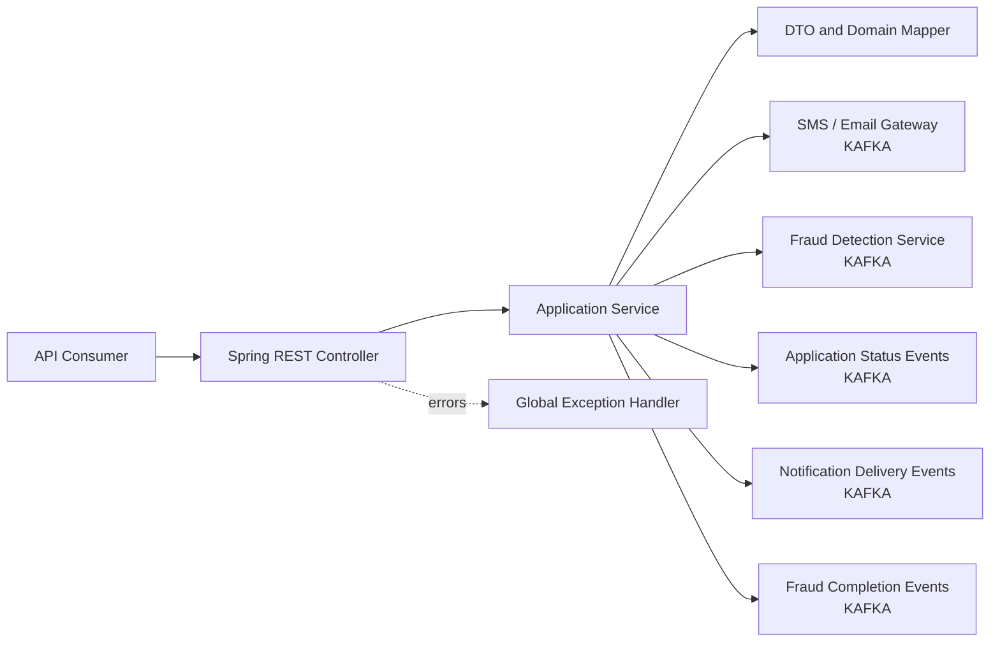

## Endpoint class and sequence diagrams

### Endpoint 1: POST /v1/applications

Creates a loan application that can subsequently be saved, resumed and submitted.

#### Class diagram

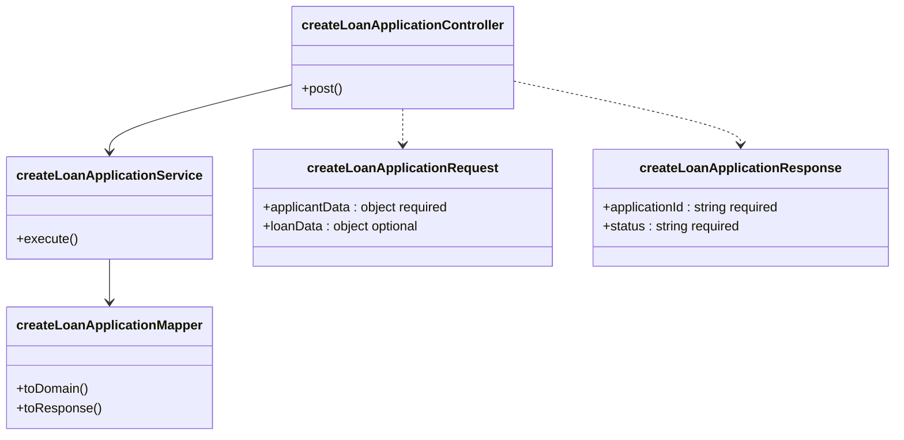

#### Sequence diagram

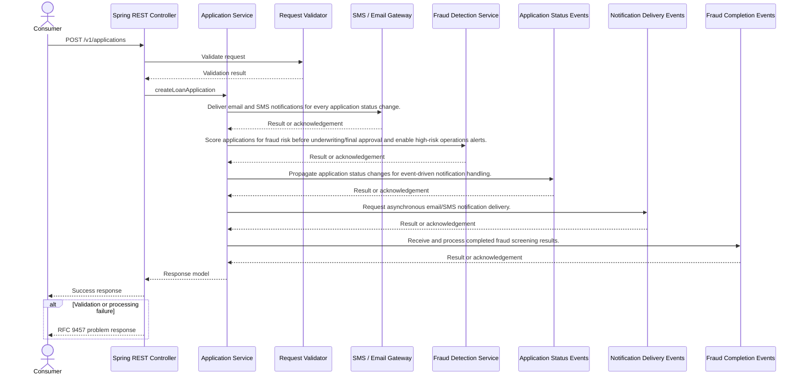

### Endpoint 2: PATCH /v1/applications/{applicationId}

Partially updates and saves an application before submission.

#### Class diagram

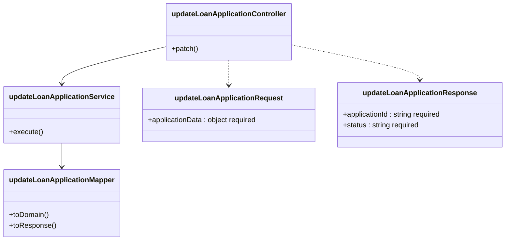

#### Sequence diagram

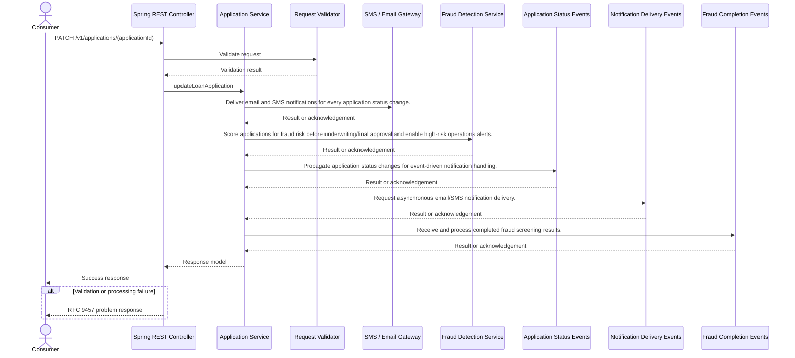

### Endpoint 3: GET /v1/applications/{applicationId}

Retrieves an existing application so the applicant can resume it.

#### Class diagram

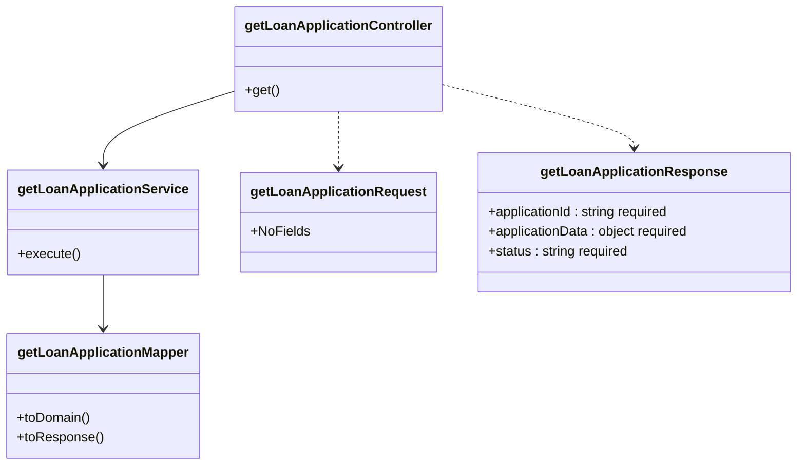

#### Sequence diagram

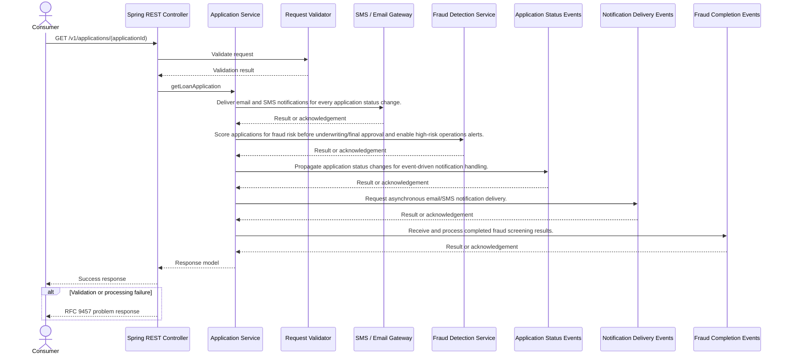

### Endpoint 4: POST /v1/applications/{applicationId}/submission

Submits a completed application and initiates required credit and fraud processing.

#### Class diagram

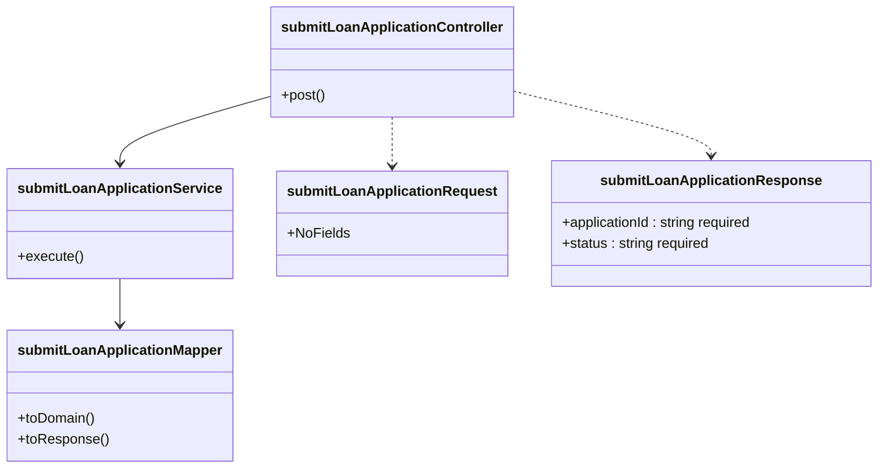

#### Sequence diagram

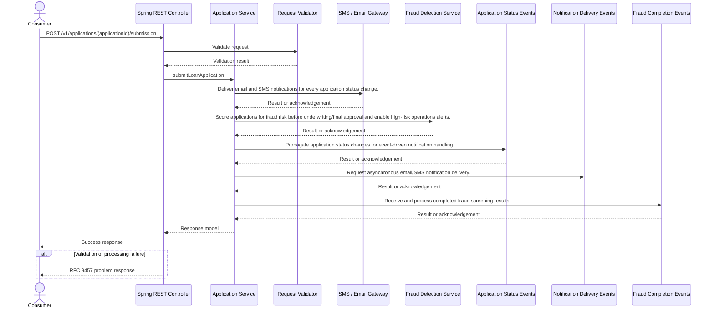

### Endpoint 5: POST /v1/applications/{applicationId}/documents

Accepts applicant supporting documents such as pay stubs, ID and proof of address. PII documents must be encrypted at rest and in transit.

#### Class diagram

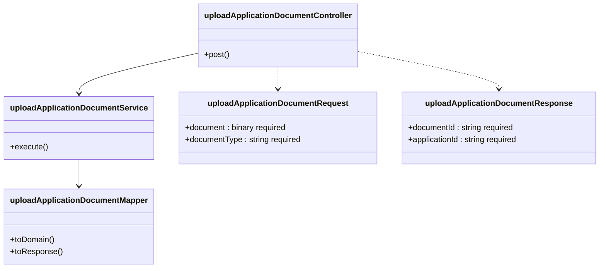

#### Sequence diagram

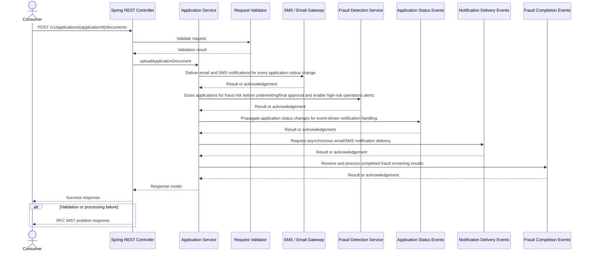

### Endpoint 6: GET /v1/applications/{applicationId}/status

Returns application status so the applicant can track progress without contacting support.

#### Class diagram

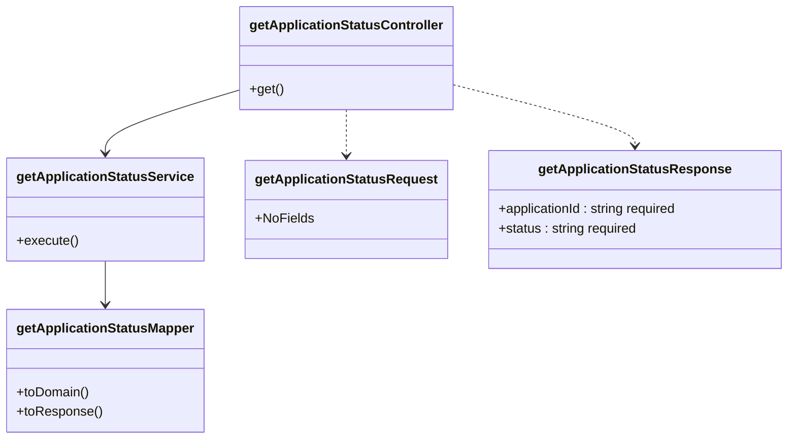

#### Sequence diagram

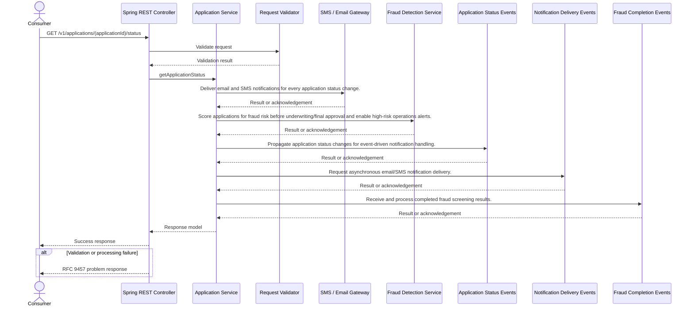

### Endpoint 7: GET /v1/applications/{applicationId}/credit-result

Returns the credit bureau result needed for the underwriter's consolidated assessment.

#### Class diagram

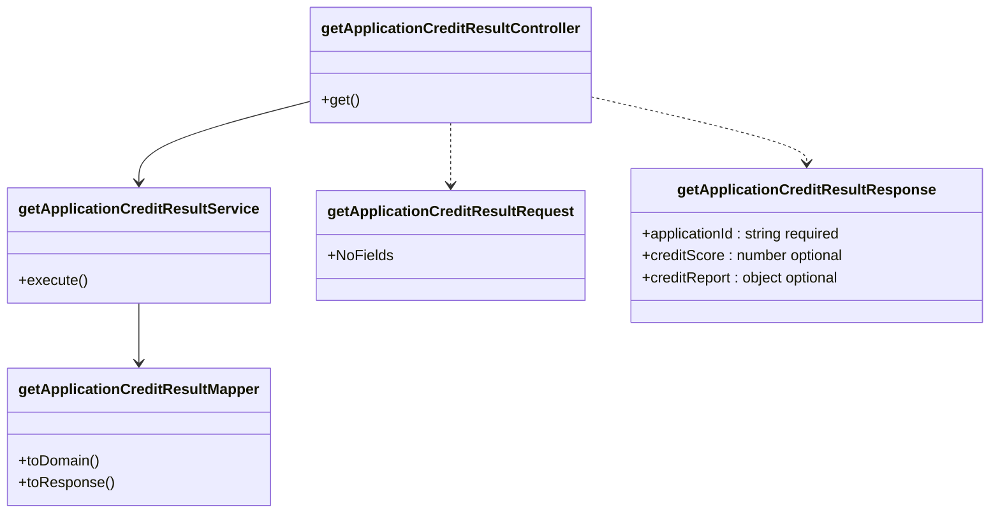

#### Sequence diagram

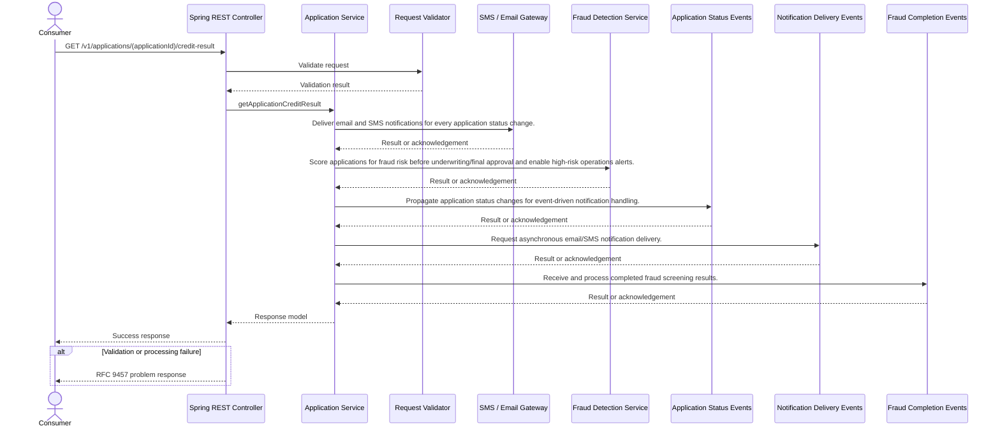

### Endpoint 8: GET /v1/applications/{applicationId}/fraud-result

Returns fraud screening results for underwriter review.

#### Class diagram

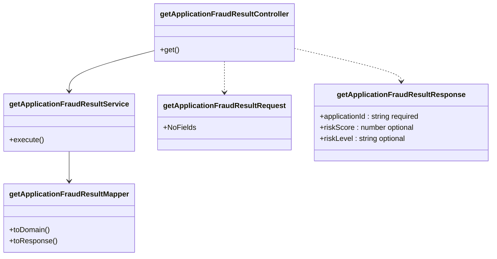

#### Sequence diagram

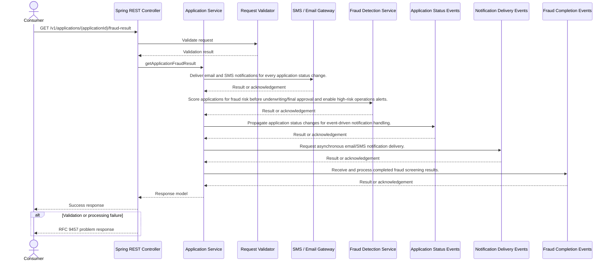

### Endpoint 9: GET /v1/applications/{applicationId}/underwriting-assessment

Provides the underwriter with credit and fraud results side by side before decisioning.

#### Class diagram

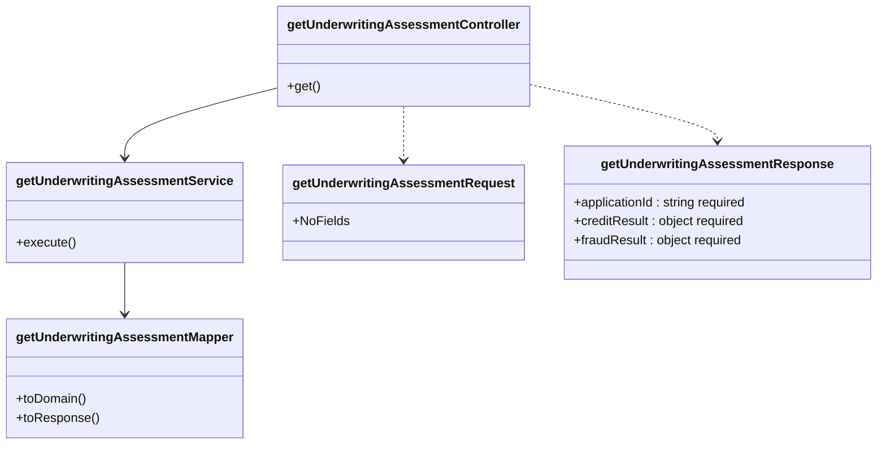

#### Sequence diagram

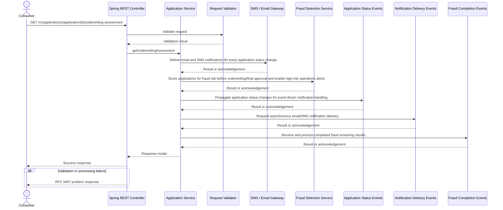

### Endpoint 10: POST /v1/applications/{applicationId}/underwriting-decisions

Records an underwriter decision after review of credit and fraud results.

#### Class diagram

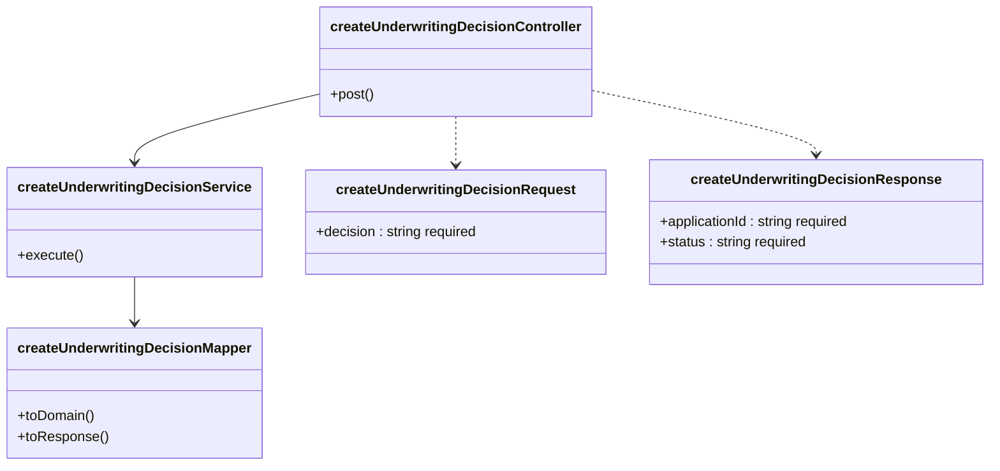

#### Sequence diagram

```mermaid
sequenceDiagram
    actor Consumer
    participant Controller as Spring REST Controller
    participant Service as Application Service
    participant Validator as Request Validator
    Consumer->>Controller: POST /v1/applications/(applicationId)/underwriting-decisions
    Controller->>Validator: Validate request
    Validator-->>Controller: Validation result
    Controller->>Service: createUnderwritingDecision
    participant Dependency1 as SMS / Email Gateway
    Service->>Dependency1: Deliver email and SMS notifications for every application status change.
    Dependency1-->>Service: Result or acknowledgement
    participant Dependency2 as Fraud Detection Service
    Service->>Dependency2: Score applications for fraud risk before underwriting/final approval and enable high-risk operations alerts.
    Dependency2-->>Service: Result or acknowledgement
    participant Dependency3 as Application Status Events
    Service->>Dependency3: Propagate application status changes for event-driven notification handling.
    Dependency3-->>Service: Result or acknowledgement
    participant Dependency4 as Notification Delivery Events
    Service->>Dependency4: Request asynchronous email/SMS notification delivery.
    Dependency4-->>Service: Result or acknowledgement
    participant Dependency5 as Fraud Completion Events
    Service->>Dependency5: Receive and process completed fraud screening results.
    Dependency5-->>Service: Result or acknowledgement
    Service-->>Controller: Response model
    Controller-->>Consumer: Success response
    alt Validation or processing failure
        Controller-->>Consumer: RFC 9457 problem response
    end
```

### Endpoint 11: GET /v1/applications/{applicationId}/loan-terms

Supports the stated synchronous core banking balance and terms lookup integration where relevant to an application.

#### Class diagram

```mermaid
classDiagram
    class getLoanTermsController {
        +get()
    }
    class getLoanTermsService {
        +execute()
    }
    class getLoanTermsMapper {
        +toDomain()
        +toResponse()
    }
    class getLoanTermsRequest {
        +NoFields
    }
    class getLoanTermsResponse {
        +terms : object required
    }
    getLoanTermsController --> getLoanTermsService
    getLoanTermsController ..> getLoanTermsRequest
    getLoanTermsController ..> getLoanTermsResponse
    getLoanTermsService --> getLoanTermsMapper
```

#### Sequence diagram

```mermaid
sequenceDiagram
    actor Consumer
    participant Controller as Spring REST Controller
    participant Service as Application Service
    participant Validator as Request Validator
    Consumer->>Controller: GET /v1/applications/(applicationId)/loan-terms
    Controller->>Validator: Validate request
    Validator-->>Controller: Validation result
    Controller->>Service: getLoanTerms
    participant Dependency1 as SMS / Email Gateway
    Service->>Dependency1: Deliver email and SMS notifications for every application status change.
    Dependency1-->>Service: Result or acknowledgement
    participant Dependency2 as Fraud Detection Service
    Service->>Dependency2: Score applications for fraud risk before underwriting/final approval and enable high-risk operations alerts.
    Dependency2-->>Service: Result or acknowledgement
    participant Dependency3 as Application Status Events
    Service->>Dependency3: Propagate application status changes for event-driven notification handling.
    Dependency3-->>Service: Result or acknowledgement
    participant Dependency4 as Notification Delivery Events
    Service->>Dependency4: Request asynchronous email/SMS notification delivery.
    Dependency4-->>Service: Result or acknowledgement
    participant Dependency5 as Fraud Completion Events
    Service->>Dependency5: Receive and process completed fraud screening results.
    Dependency5-->>Service: Result or acknowledgement
    Service-->>Controller: Response model
    Controller-->>Consumer: Success response
    alt Validation or processing failure
        Controller-->>Consumer: RFC 9457 problem response
    end
```

### Endpoint 12: POST /v1/applications/{applicationId}/funding

Initiates the transition to funded status, including core banking loan account creation implied by the stated integration purpose.

#### Class diagram

```mermaid
classDiagram
    class fundApprovedLoanController {
        +post()
    }
    class fundApprovedLoanService {
        +execute()
    }
    class fundApprovedLoanMapper {
        +toDomain()
        +toResponse()
    }
    class fundApprovedLoanRequest {
        +NoFields
    }
    class fundApprovedLoanResponse {
        +applicationId : string required
        +status : string required
        +loanAccountId : string optional
    }
    fundApprovedLoanController --> fundApprovedLoanService
    fundApprovedLoanController ..> fundApprovedLoanRequest
    fundApprovedLoanController ..> fundApprovedLoanResponse
    fundApprovedLoanService --> fundApprovedLoanMapper
```

#### Sequence diagram

```mermaid
sequenceDiagram
    actor Consumer
    participant Controller as Spring REST Controller
    participant Service as Application Service
    participant Validator as Request Validator
    Consumer->>Controller: POST /v1/applications/(applicationId)/funding
    Controller->>Validator: Validate request
    Validator-->>Controller: Validation result
    Controller->>Service: fundApprovedLoan
    participant Dependency1 as SMS / Email Gateway
    Service->>Dependency1: Deliver email and SMS notifications for every application status change.
    Dependency1-->>Service: Result or acknowledgement
    participant Dependency2 as Fraud Detection Service
    Service->>Dependency2: Score applications for fraud risk before underwriting/final approval and enable high-risk operations alerts.
    Dependency2-->>Service: Result or acknowledgement
    participant Dependency3 as Application Status Events
    Service->>Dependency3: Propagate application status changes for event-driven notification handling.
    Dependency3-->>Service: Result or acknowledgement
    participant Dependency4 as Notification Delivery Events
    Service->>Dependency4: Request asynchronous email/SMS notification delivery.
    Dependency4-->>Service: Result or acknowledgement
    participant Dependency5 as Fraud Completion Events
    Service->>Dependency5: Receive and process completed fraud screening results.
    Dependency5-->>Service: Result or acknowledgement
    Service-->>Controller: Response model
    Controller-->>Consumer: Success response
    alt Validation or processing failure
        Controller-->>Consumer: RFC 9457 problem response
    end
```

## Non-REST integration diagrams

### Integration 1: SMS / Email Gateway

Deliver email and SMS notifications for every application status change.

#### Component diagram

```mermaid
flowchart LR
    Service[Application Service]
    Adapter[Apache Kafka Adapter]
    Target[SMS / Email Gateway<br/>KAFKA]
    Service --> Adapter
    Adapter --> Target
```

#### Sequence diagram

```mermaid
sequenceDiagram
    participant Service as Application Service
    participant Adapter as Apache Kafka Adapter
    participant Target as SMS / Email Gateway
    Service->>Adapter: Deliver email and SMS notifications for every application status change.
    Adapter->>Target: Publish or consume event
    Target-->>Adapter: Result or acknowledgement
    Adapter-->>Service: Normalised result
    alt Integration failure
        Adapter-->>Service: Translated integration exception
    end
```

### Integration 2: Fraud Detection Service

Score applications for fraud risk before underwriting/final approval and enable high-risk operations alerts.

#### Component diagram

```mermaid
flowchart LR
    Service[Application Service]
    Adapter[Apache Kafka Adapter]
    Target[Fraud Detection Service<br/>KAFKA]
    Service --> Adapter
    Adapter --> Target
```

#### Sequence diagram

```mermaid
sequenceDiagram
    participant Service as Application Service
    participant Adapter as Apache Kafka Adapter
    participant Target as Fraud Detection Service
    Service->>Adapter: Score applications for fraud risk before underwriting/final approval and enable high-risk operations alerts.
    Adapter->>Target: Publish or consume event
    Target-->>Adapter: Result or acknowledgement
    Adapter-->>Service: Normalised result
    alt Integration failure
        Adapter-->>Service: Translated integration exception
    end
```

### Integration 3: Application Status Events

Propagate application status changes for event-driven notification handling.

#### Component diagram

```mermaid
flowchart LR
    Service[Application Service]
    Adapter[Apache Kafka Adapter]
    Target[Application Status Events<br/>KAFKA]
    Service --> Adapter
    Adapter --> Target
```

#### Sequence diagram

```mermaid
sequenceDiagram
    participant Service as Application Service
    participant Adapter as Apache Kafka Adapter
    participant Target as Application Status Events
    Service->>Adapter: Propagate application status changes for event-driven notification handling.
    Adapter->>Target: Publish or consume event
    Target-->>Adapter: Result or acknowledgement
    Adapter-->>Service: Normalised result
    alt Integration failure
        Adapter-->>Service: Translated integration exception
    end
```

### Integration 4: Notification Delivery Events

Request asynchronous email/SMS notification delivery.

#### Component diagram

```mermaid
flowchart LR
    Service[Application Service]
    Adapter[Apache Kafka Adapter]
    Target[Notification Delivery Events<br/>KAFKA]
    Service --> Adapter
    Adapter --> Target
```

#### Sequence diagram

```mermaid
sequenceDiagram
    participant Service as Application Service
    participant Adapter as Apache Kafka Adapter
    participant Target as Notification Delivery Events
    Service->>Adapter: Request asynchronous email/SMS notification delivery.
    Adapter->>Target: Publish or consume event
    Target-->>Adapter: Result or acknowledgement
    Adapter-->>Service: Normalised result
    alt Integration failure
        Adapter-->>Service: Translated integration exception
    end
```

### Integration 5: Fraud Completion Events

Receive and process completed fraud screening results.

#### Component diagram

```mermaid
flowchart LR
    Service[Application Service]
    Adapter[Apache Kafka Adapter]
    Target[Fraud Completion Events<br/>KAFKA]
    Service --> Adapter
    Adapter --> Target
```

#### Sequence diagram

```mermaid
sequenceDiagram
    participant Service as Application Service
    participant Adapter as Apache Kafka Adapter
    participant Target as Fraud Completion Events
    Service->>Adapter: Receive and process completed fraud screening results.
    Adapter->>Target: Publish or consume event
    Target-->>Adapter: Result or acknowledgement
    Adapter-->>Service: Normalised result
    alt Integration failure
        Adapter-->>Service: Translated integration exception
    end
```

## Assumptions

- Spring Boot is the runtime because no alternative runtime is specified and the instruction defines Spring Boot as the default.
- Core banking REST APIs are assumed stable and require no modification because section 7 explicitly states this assumption.
- Credit bureau and fraud vendors are assumed to support required call volumes without new contracts because section 7 explicitly states this assumption.
- Notification templates will be supplied by marketing before development because section 7 explicitly states this assumption.
- Moderate point-to-point mapping and enrichment is assumed rather than a canonical model because section 6 explicitly states moderate remapping is required and no complex canonicalization is anticipated.
- The inferred API set contains approximately 12 endpoints because section 4 gives an approximate rather than exact endpoint count.
## Risks

- Document storage architecture cannot be finalized because the requirement explicitly leaves existing DMS versus a new object store open.
- Capacity and scaling cannot be sized because expected peak concurrent applicant volume is explicitly an open question.
- Submission workflow latency and orchestration remain uncertain because the requirement explicitly asks whether fraud screening blocks submission synchronously or runs asynchronously post-submission.
- The requirement states fraud integration is asynchronous but also asks whether fraud must block submission, creating an unresolved workflow boundary.
- Credit and fraud external schemas are not supplied even though section 6 requires field re-mapping and enrichment.
- PII document storage introduces compliance risk because encryption at rest and in transit is mandatory while the storage platform remains undecided.
## Dependencies

- Core Banking Platform REST APIs are required for the explicitly stated loan account creation, balance and terms lookup capabilities.
- Credit Bureau Service availability is required because a credit report must be pulled once an application is submitted.
- Fraud Detection Service and the event-driven layer are required because every application must be fraud screened before underwriting/final approval.
- SMS / Email Gateway and Kafka event processing are required because applicants must receive email and SMS on every status change.
- Marketing must provide notification templates ahead of development as explicitly stated in section 7.
- A document storage decision is required because applicant document upload is in scope while DMS versus object store remains open.
- OAuth 2.0 client credentials and downstream client registrations/secrets are required because all service-to-service downstream calls must use this flow.
## In scope

- Applicant-facing online application submission and document upload are explicitly in scope.
- Starting, saving and resuming a loan application are explicit functional requirements.
- Real-time applicant status tracking for submitted, under review, approved, declined and funded states is explicitly in scope.
- Automatic email and SMS notification on every status change is explicitly required.
- Automatic post-submission credit report retrieval is explicitly required.
- Automatic fraud screening before underwriting/final approval is explicitly required.
- An underwriter view consolidating credit and fraud results is explicitly in scope.
- Underwriter approval and decline decisioning is included in the stated REST API scope.
- Secure service-to-service integration with existing bank systems is explicitly in scope.
- Audit logging of access to credit bureau data is explicitly required.
- Encryption at rest and in transit for applicant-uploaded PII documents is explicitly required.
## Out of scope

- Co-branded partner lending is explicitly out of scope for this phase.
- International applicants are explicitly out of scope for this phase.
- Manual underwriting override workflows are explicitly deferred to phase 2.
- Complex canonicalization across multiple disparate schemas is not anticipated according to section 6.
- Modification of core banking REST APIs is not expected because section 7 assumes those APIs are stable and require no modification.
## Ambiguities

- The exact REST endpoint inventory is not defined; the requirement states only approximately 12 endpoints, so endpoint decomposition is inferred.
- Exact applicant and loan application fields, validation rules and requiredness are not supplied.
- Authentication and authorization for applicant-facing and underwriter-facing APIs are not specified; OAuth 2.0 client credentials is stated only for service-to-service calls.
- It is undecided whether uploaded documents use the existing Document Management System or a new object store.
- Expected peak concurrent applicant volume is not specified.
- It is unresolved whether fraud screening blocks submission synchronously or executes asynchronously post-submission.
- Kafka message schemas, keys, partitions, retention, retry, dead-letter and delivery semantics are not specified for the three named topics.
- The mechanism and destination for high-risk operations alerts are not specified.
- Credit bureau request/response schema, score representation and audit log retention requirements are not specified.
- Fraud risk score scale, high-risk threshold and result schema are not specified.
- Rules and trigger timing for progression from approved to funded, including disbursement details, are not specified.
- Document size limits, MIME types, malware scanning, retention and retrieval requirements for applicant-uploaded documents are not specified.
- Although the DMS purpose specifies signed loan agreements and disclosures, the relationship between those documents and applicant-uploaded pay stubs, ID and proof of address is not defined.
- Notification retry, failure handling, delivery status tracking and applicant contact preference rules are not specified.
