# Digital Loan Origination — Applicant Self-Service Enhancement

## Summary
Applicant self-service loan origination capability supporting application draft/resume and submission, supporting-document upload, real-time status retrieval, automated credit and fraud screening, underwriter review and decisioning, and status-driven email/SMS notifications. The solution integrates with existing banking and external services and uses Kafka for event-driven status, fraud, and notification processing.

## Overall component diagram
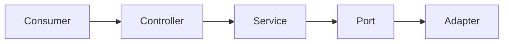

## Endpoint 1: POST /v1/applications

### Class diagram
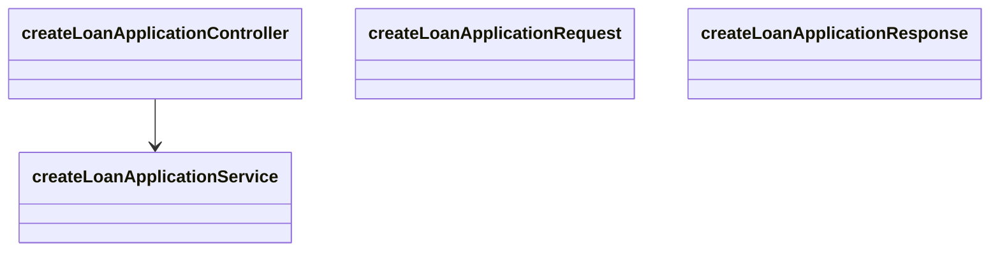

### Sequence diagram
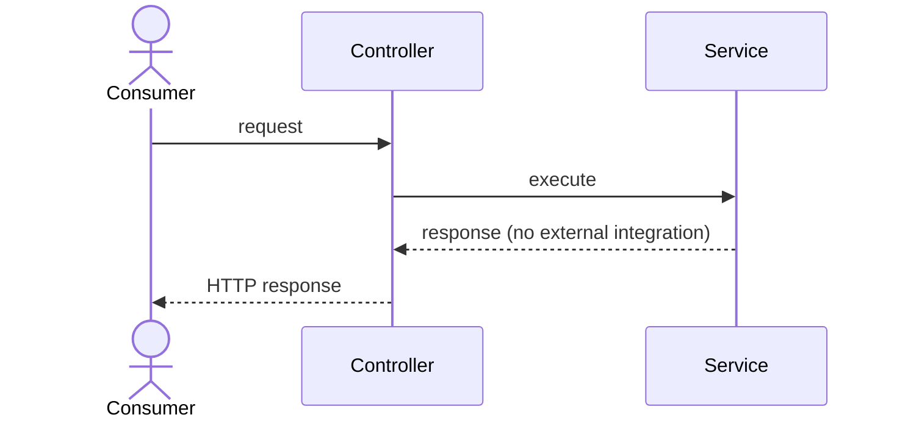

## Endpoint 2: GET /v1/applications/{applicationId}

### Class diagram
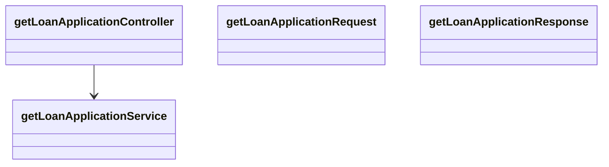

### Sequence diagram

## Endpoint 3: PATCH /v1/applications/{applicationId}

### Class diagram

### Sequence diagram

## Endpoint 4: POST /v1/applications/{applicationId}/submission

**Integrations invoked:** Credit Bureau Service (REST_CLIENT), Fraud Detection Service (OTHER)

### Class diagram
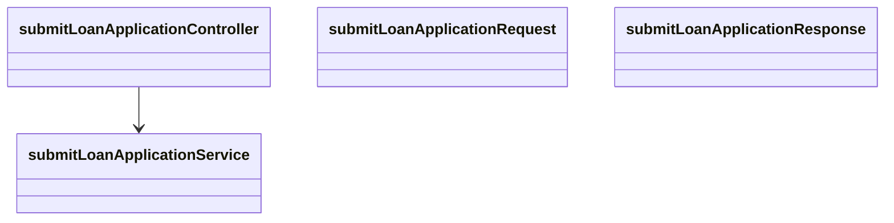

### Sequence diagram
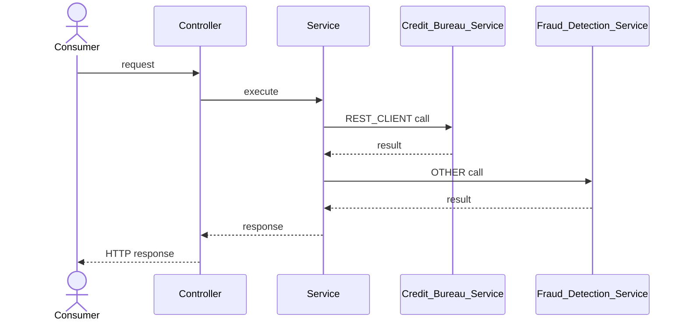

## Endpoint 5: POST /v1/applications/{applicationId}/documents

**Integrations invoked:** Document Management System (REST_CLIENT)

### Class diagram

### Sequence diagram
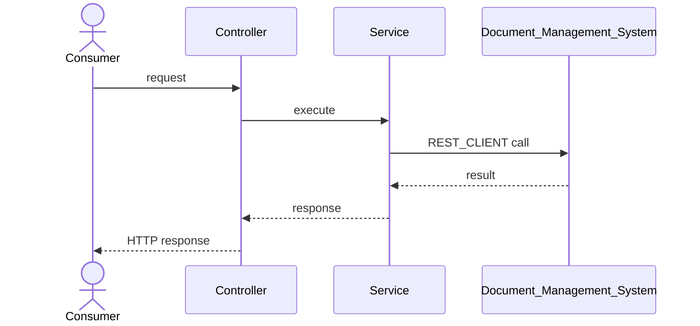

## Endpoint 6: GET /v1/applications/{applicationId}/status

### Class diagram

### Sequence diagram

## Endpoint 7: GET /v1/applications/{applicationId}/underwriting-assessment

**Integrations invoked:** Credit Bureau Audit Logging (DATABASE)

### Class diagram
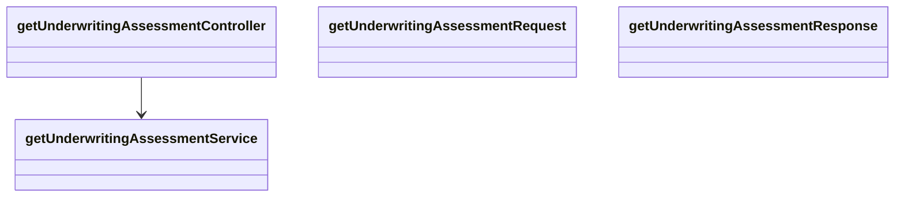

### Sequence diagram
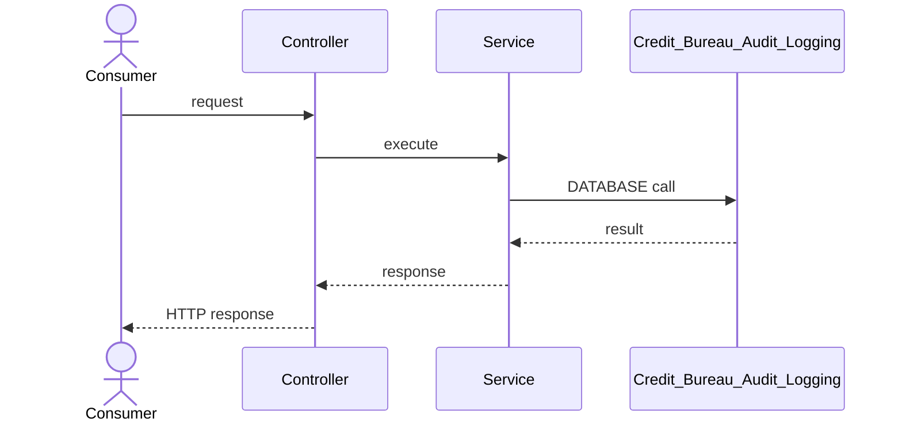

## Endpoint 8: POST /v1/applications/{applicationId}/decisions

**Integrations invoked:** Core Banking Platform (REST_CLIENT), Application Status Changed Topic (KAFKA)

### Class diagram
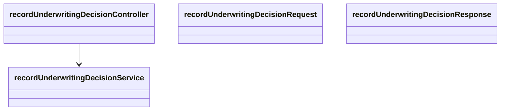

### Sequence diagram
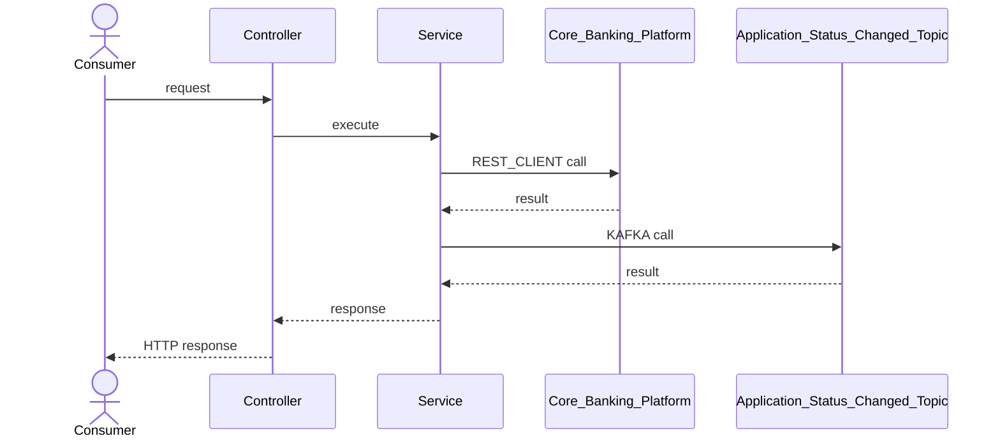

## Integration inventory
- **Core Banking Platform** (REST_CLIENT, REST with OAuth 2.0 client credentials): Integrate with existing bank loan data and support loan account creation, balance lookup, and terms lookup.
- **Credit Bureau Service** (REST_CLIENT, Synchronous REST with OAuth 2.0 client credentials): Pull the applicant credit report and score automatically after application submission, with schema mapping/enrichment and audit logging of access.
- **Document Management System** (REST_CLIENT, Synchronous REST with OAuth 2.0 client credentials): Candidate existing system for document storage and retrieval; final use for applicant uploads remains an architecture question.
- **Fraud Detection Service** (OTHER, Asynchronous event-driven integration): Score submitted applications for fraud risk and provide results before final approval.
- **SMS / Email Gateway** (OTHER, Asynchronous event-driven integration): Deliver applicant email and SMS notifications for application status changes.
- **Application Status Changed Topic** (KAFKA, Kafka topic application-status-changed): Publish application status changes for downstream event-driven processing including notifications.
- **Fraud Check Completed Topic** (KAFKA, Kafka topic fraud-check-completed): Consume completed fraud-screening results, including high-risk results requiring an operations alert.
- **Notification Delivery Requested Topic** (KAFKA, Kafka topic notification-delivery-requested): Carry requests for asynchronous applicant notification delivery through email and SMS.
- **Credit Bureau Audit Logging** (DATABASE, Persistent audit store): Persist audit records whenever credit bureau data is accessed.

## Manual integration follow-ups required
- **Fraud Detection Service** (OTHER): the generated adapter throws `UnsupportedOperationException` until a developer implements the real integration for: Score submitted applications for fraud risk and provide results before final approval.
- **SMS / Email Gateway** (OTHER): the generated adapter throws `UnsupportedOperationException` until a developer implements the real integration for: Deliver applicant email and SMS notifications for application status changes.

## Assumptions
- The Core Banking Platform's existing REST APIs are stable and require no modification for this phase.
- The Credit Bureau Service and Fraud Detection Service can support required transaction volumes without new vendor contracts.
- Marketing will provide email and SMS notification templates before notification functionality is developed.
- The documented applicant statuses submitted, under review, approved, declined, and funded are the applicant-visible status values required for this phase.
- The stated estimate of approximately 12 REST endpoints is indicative rather than a requirement to invent endpoints; only operations directly supported by the functional requirements are modeled.

## Risks
- Peak concurrent applicant volume is unspecified, so capacity requirements for application submission, status retrieval, Kafka processing, and downstream integrations cannot yet be sized.
- Whether fraud screening blocks submission or runs asynchronously post-submission is unresolved and can materially change submitLoanApplication behavior and latency.
- The storage destination for applicant-uploaded documents is unresolved between the existing Document Management System and a new object store.
- Moderate field mapping and enrichment between core banking data and Credit Bureau Service/Fraud Detection Service formats introduces transformation and data-quality risk.
- Every status change requires both email and SMS delivery, making Kafka and notification-gateway failures relevant to meeting the notification requirement.

## Dependencies
- Credit Bureau Service availability and capacity are required to automatically obtain a credit report after application submission.
- Fraud Detection Service and fraud-check-completed event processing are required to make fraud results available before final approval and to detect high-risk applications.
- The SMS / Email Gateway and marketing-provided templates are required for email and SMS notifications on every application status change.
- A document-storage architecture decision is required before uploadSupportingDocument storage behavior can be finalized.
- OAuth 2.0 client-credentials support and credentials are required for service-to-service calls to downstream systems.

## In scope
- Applicant creation, saving, resuming, and submission of online loan applications.
- Applicant upload of pay stubs, ID, and proof-of-address supporting documents with PII encryption requirements.
- Applicant retrieval of current application status across submitted, under review, approved, declined, and funded stages.
- Automatic credit-report retrieval and fraud-risk screening for submitted applications.
- Consolidated underwriter access to credit and fraud results followed by approval or decline decisioning.
- Email and SMS notification on every application status change and an operations alert for high-risk fraud screening results.
- OAuth 2.0 client-credentials security for service-to-service downstream integrations and audit logging of credit bureau data access.

## Out of scope
- Co-branded partner lending is explicitly excluded from this phase.
- International applicants are explicitly excluded from this phase.
- Manual underwriting override workflows are explicitly deferred to phase 2.
- Complex canonicalization across multiple disparate external schemas is not anticipated for this phase.

## Ambiguities
- No acceptance criteria were supplied, so endpoint response semantics, validation details, error handling, and measurable completion criteria are unspecified.
- The requirement says approximately 12 REST endpoints are expected but does not define all 12 operations; inventing additional CRUD operations solely to reach that number is not justified.
- It is unresolved whether applicant document uploads should use the existing Document Management System or a new object store.
- It is unresolved whether fraud screening must synchronously block application submission or execute asynchronously after submission.
- The expected peak concurrent applicant volume for launch is unspecified.
- The complete application data model, mandatory submission fields, loan product fields, applicant identity fields, and validation constraints are not specified.
- The mechanism that changes an approved application to funded status and the exact point at which Core Banking Platform loan account creation occurs are not specified.
- The requirement identifies three Kafka topics but does not fully define producer/consumer ownership, event schemas, partitioning, retry handling, or dead-letter behavior.
- The mechanism and recipient/channel for the operations-team high-risk fraud alert are not specified.
- The requirement states that credit bureau access must be audit logged but does not specify whether automated retrieval, underwriter viewing, or both constitute auditable access.
