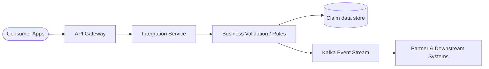
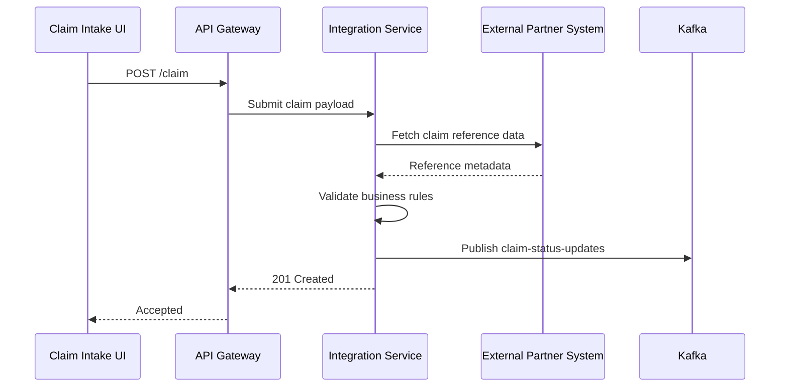
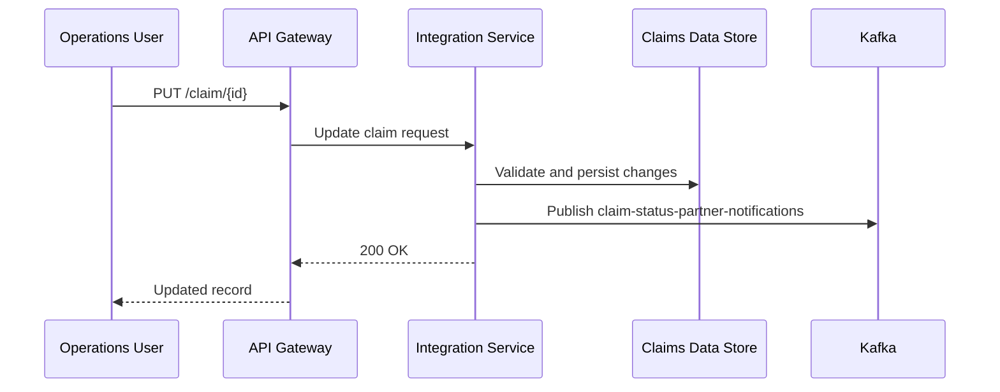
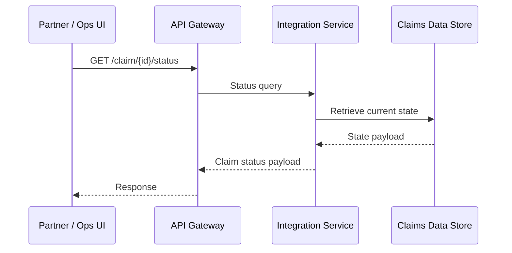
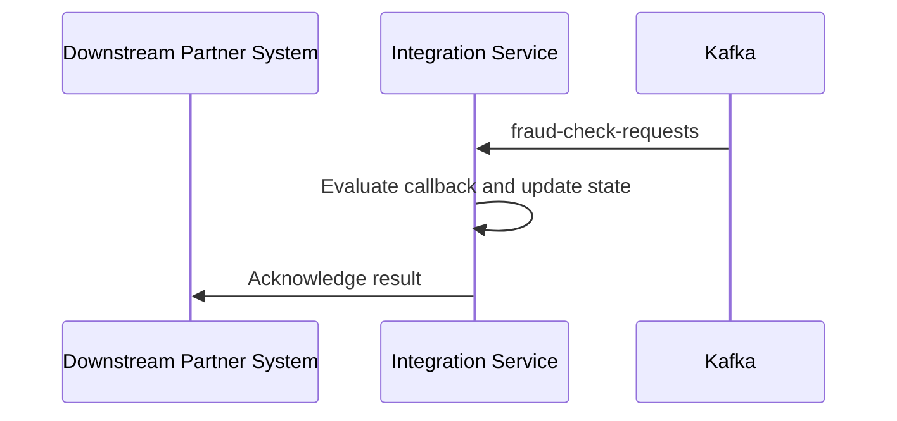
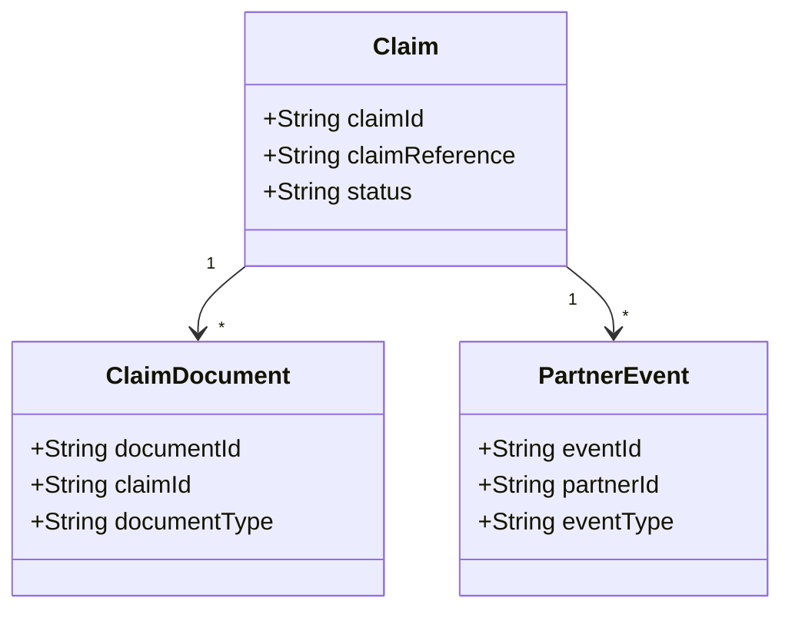
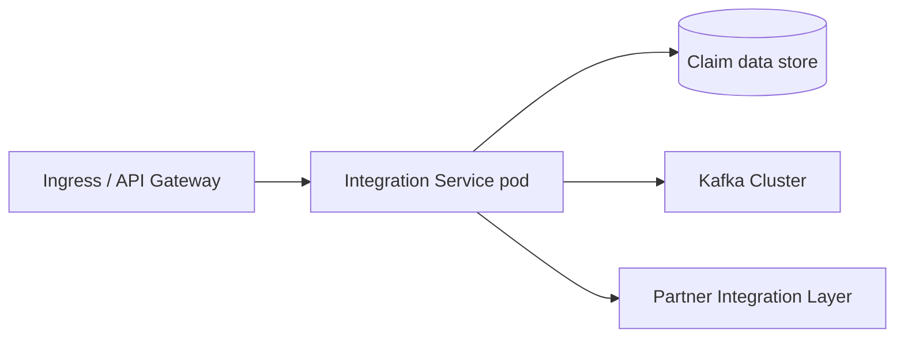

# Integration Service

## 1. Document Overview

### Purpose
Integration Service provides a unified API layer for claim orchestration, partner interaction, and event propagation across the target workflow.

### Scope
#### In Scope
- Claim submission and lookup APIs
- Claim validation and status retrieval
- Event publication to downstream systems
- Integration with external partner systems

#### Out of Scope
- User authentication platform
- Reporting services
- Notification platform
- Separate workflow orchestration domain

## 2. Business Context

### Problem Statement
The target business workflow spans multiple internal systems and external partners, which creates fragmented visibility and delayed updates. Integration Service addresses this by consolidating claim operations, validating the workflow, and publishing status events to downstream consumers.

### Business Capabilities Supported
| Capability | Description |
|---|---|---|
| Claim Lookup | Retrieve current state and metadata for the target business record |
| Claim Submission | Submit and validate the target workflow request |
| State Tracking | Query lifecycle or processing status |
| Partner Event Integration | Publish and consume callbacks and partner events |

## 3. Service Overview

### Service Responsibilities
- Create claim
- Retrieve claim details
- Validate claim state transitions
- Publish business events
- Consume partner callbacks
- Enforce workflow validation rules

### Service Boundaries
#### Owned by Service
- Claim lifecycle data
- Claim APIs
- Business validation rules
- Event contracts

#### Not Owned
- Authentication
- Notification
- Separate workflow orchestration
- Reporting

## 4. Functional Architecture

This Complex integration (score 7) coordinates claim-status processing across three external systems using six Kafka topics: claim-status-updates, claim-status-partner-notifications, fraud-check-requests, fraud-check-callbacks, payment-claim-status-events, and document-claim-status-events. It exposes no APIs and requires no data transformation, while OAuth security, Kafka integration, and coordination with the external systems are the primary drivers of the estimated 5-7 PM effort. EDA style: pub_sub. Test scope: Cover Kafka producer/consumer flows across all 6 topics, OAuth, external-system integration, failures, and end-to-end pub/sub scenarios..



## 5. API Design

### API Catalogue
| API | Method | Purpose |
|---|---|---|
| POST /claims | POST | Submit a new claim for adjudication |
| GET /claims/{id} | GET | Retrieve claim details |
| PUT /claims/{id} | PUT | Update claim information |
| GET /policies/{policyId} | GET | Look up policy details for a claim |
| POST /claims/{id}/submit | POST | Submit claim for adjudication |
| GET /claims/{id}/status | GET | Fetch current claim status |
| POST /claims/{id}/fraud-check | POST | Trigger fraud check callback flow |
| GET /claims/{id}/documents | GET | Fetch claim-related documents |
| POST /claims/{id}/documents | POST | Attach supporting documentary evidence |
| GET /partners/{partnerId}/status | GET | View partner integration status |
| POST /partners/{partnerId}/callbacks | POST | Accept partner event callback payloads |
| PATCH /claims/{id}/status | PATCH | Apply updated claim processing status |

### API 1: POST /claims

**Endpoint**
POST /claims

**Request**
```json
{
  "claimId": "CLM-1001",
  "claimReference": "REF-1001"
}
```

**Response**
```json
{
  "claimId": "CLM-1001",
  "status": "submitted"
}
```

**Purpose**
Submit a new claim for adjudication

**Validations**
- The primary business identifier is required for all create/update operations
- Reference fields must map to valid external or internal system keys
- Status transitions must follow the target business workflow
- Search filters must not exceed the allowed maximum length

**Error Codes**
- 400 Bad Request
- 401 Unauthorized
- 404 Not Found
- 409 Conflict
- 500 Internal Server Error

### API 2: GET /claims/{id}

**Endpoint**
GET /claims/{id}

**Request**
```json
{
  "claimId": "CLM-1001",
  "claimReference": "REF-1001"
}
```

**Response**
```json
{
  "claimId": "CLM-1001",
  "claimReference": "REF-1001"
}
```

**Purpose**
Retrieve claim details

**Validations**
- The primary business identifier is required for all create/update operations
- Reference fields must map to valid external or internal system keys
- Status transitions must follow the target business workflow
- Search filters must not exceed the allowed maximum length

**Error Codes**
- 400 Bad Request
- 401 Unauthorized
- 404 Not Found
- 409 Conflict
- 500 Internal Server Error

### API 3: PUT /claims/{id}

**Endpoint**
PUT /claims/{id}

**Request**
```json
{
  "claimId": "CLM-1001",
  "claimReference": "REF-1001"
}
```

**Response**
```json
{
  "claimId": "CLM-1001",
  "claimReference": "REF-1001"
}
```

**Purpose**
Update claim information

**Validations**
- The primary business identifier is required for all create/update operations
- Reference fields must map to valid external or internal system keys
- Status transitions must follow the target business workflow
- Search filters must not exceed the allowed maximum length

**Error Codes**
- 400 Bad Request
- 401 Unauthorized
- 404 Not Found
- 409 Conflict
- 500 Internal Server Error

### API 4: GET /policies/{policyId}

**Endpoint**
GET /policies/{policyId}

**Request**
```json
{
  "claimId": "CLM-1001",
  "claimReference": "REF-1001"
}
```

**Response**
```json
{
  "claimId": "CLM-1001",
  "status": "submitted"
}
```

**Purpose**
Look up policy details for a claim

**Validations**
- The primary business identifier is required for all create/update operations
- Reference fields must map to valid external or internal system keys
- Status transitions must follow the target business workflow
- Search filters must not exceed the allowed maximum length

**Error Codes**
- 400 Bad Request
- 401 Unauthorized
- 404 Not Found
- 409 Conflict
- 500 Internal Server Error

### API 5: POST /claims/{id}/submit

**Endpoint**
POST /claims/{id}/submit

**Request**
```json
{
  "claimId": "CLM-1001",
  "claimReference": "REF-1001"
}
```

**Response**
```json
{
  "claimId": "CLM-1001",
  "claimReference": "REF-1001"
}
```

**Purpose**
Submit claim for adjudication

**Validations**
- The primary business identifier is required for all create/update operations
- Reference fields must map to valid external or internal system keys
- Status transitions must follow the target business workflow
- Search filters must not exceed the allowed maximum length

**Error Codes**
- 400 Bad Request
- 401 Unauthorized
- 404 Not Found
- 409 Conflict
- 500 Internal Server Error

### API 6: GET /claims/{id}/status

**Endpoint**
GET /claims/{id}/status

**Request**
```json
{
  "claimId": "CLM-1001",
  "claimReference": "REF-1001",
  "includeHistory": true
}
```

**Response**
```json
{
  "claimId": "CLM-1001",
  "status": "in_review"
}
```

**Purpose**
Fetch current claim status

**Validations**
- The primary business identifier is required for all create/update operations
- Reference fields must map to valid external or internal system keys
- Status transitions must follow the target business workflow
- Search filters must not exceed the allowed maximum length

**Error Codes**
- 400 Bad Request
- 401 Unauthorized
- 404 Not Found
- 409 Conflict
- 500 Internal Server Error

### API 7: POST /claims/{id}/fraud-check

**Endpoint**
POST /claims/{id}/fraud-check

**Request**
```json
{
  "claimId": "CLM-1001",
  "claimReference": "REF-1001"
}
```

**Response**
```json
{
  "claimId": "CLM-1001",
  "claimReference": "REF-1001"
}
```

**Purpose**
Trigger fraud check callback flow

**Validations**
- The primary business identifier is required for all create/update operations
- Reference fields must map to valid external or internal system keys
- Status transitions must follow the target business workflow
- Search filters must not exceed the allowed maximum length

**Error Codes**
- 400 Bad Request
- 401 Unauthorized
- 404 Not Found
- 409 Conflict
- 500 Internal Server Error

### API 8: GET /claims/{id}/documents

**Endpoint**
GET /claims/{id}/documents

**Request**
```json
{
  "claimId": "CLM-1001",
  "claimReference": "REF-1001"
}
```

**Response**
```json
{
  "claimId": "CLM-1001",
  "claimReference": "REF-1001"
}
```

**Purpose**
Fetch claim-related documents

**Validations**
- The primary business identifier is required for all create/update operations
- Reference fields must map to valid external or internal system keys
- Status transitions must follow the target business workflow
- Search filters must not exceed the allowed maximum length

**Error Codes**
- 400 Bad Request
- 401 Unauthorized
- 404 Not Found
- 409 Conflict
- 500 Internal Server Error

### API 9: POST /claims/{id}/documents

**Endpoint**
POST /claims/{id}/documents

**Request**
```json
{
  "claimId": "CLM-1001",
  "claimReference": "REF-1001"
}
```

**Response**
```json
{
  "claimId": "CLM-1001",
  "claimReference": "REF-1001"
}
```

**Purpose**
Attach supporting documentary evidence

**Validations**
- The primary business identifier is required for all create/update operations
- Reference fields must map to valid external or internal system keys
- Status transitions must follow the target business workflow
- Search filters must not exceed the allowed maximum length

**Error Codes**
- 400 Bad Request
- 401 Unauthorized
- 404 Not Found
- 409 Conflict
- 500 Internal Server Error

### API 10: GET /partners/{partnerId}/status

**Endpoint**
GET /partners/{partnerId}/status

**Request**
```json
{
  "claimId": "CLM-1001",
  "claimReference": "REF-1001",
  "includeHistory": true
}
```

**Response**
```json
{
  "claimId": "CLM-1001",
  "status": "in_review"
}
```

**Purpose**
View partner integration status

**Validations**
- The primary business identifier is required for all create/update operations
- Reference fields must map to valid external or internal system keys
- Status transitions must follow the target business workflow
- Search filters must not exceed the allowed maximum length

**Error Codes**
- 400 Bad Request
- 401 Unauthorized
- 404 Not Found
- 409 Conflict
- 500 Internal Server Error

### API 11: POST /partners/{partnerId}/callbacks

**Endpoint**
POST /partners/{partnerId}/callbacks

**Request**
```json
{
  "claimId": "CLM-1001",
  "claimReference": "REF-1001"
}
```

**Response**
```json
{
  "claimId": "CLM-1001",
  "status": "submitted"
}
```

**Purpose**
Accept partner event callback payloads

**Validations**
- The primary business identifier is required for all create/update operations
- Reference fields must map to valid external or internal system keys
- Status transitions must follow the target business workflow
- Search filters must not exceed the allowed maximum length

**Error Codes**
- 400 Bad Request
- 401 Unauthorized
- 404 Not Found
- 409 Conflict
- 500 Internal Server Error

### API 12: PATCH /claims/{id}/status

**Endpoint**
PATCH /claims/{id}/status

**Request**
```json
{
  "claimId": "CLM-1001",
  "claimReference": "REF-1001",
  "includeHistory": true
}
```

**Response**
```json
{
  "claimId": "CLM-1001",
  "status": "in_review"
}
```

**Purpose**
Apply updated claim processing status

**Validations**
- The primary business identifier is required for all create/update operations
- Reference fields must map to valid external or internal system keys
- Status transitions must follow the target business workflow
- Search filters must not exceed the allowed maximum length

**Error Codes**
- 400 Bad Request
- 401 Unauthorized
- 404 Not Found
- 409 Conflict
- 500 Internal Server Error

## 6. Sequence Diagrams

### Submit Business Flow


### Update State Flow


### Query Status Flow


### Callback / Event Publication Flow


## 7. Data Model

### Entity Diagram


### Database Tables
| Table | Purpose |
|---|---|---|
| CLAIM | Core business record |
| CLAIM_DOCUMENT | Supporting document metadata |
| EVENT_LOG | Event audit and traceability record |

## 8. Integration Design

### Downstream Systems
| System | Type |
|---|---|---|
| Core Data Store | Sync |
| Kafka | Async |
| External Partner Gateway | Async |

### Events Published
- claim-status-updates
- claim-status-partner-notifications
- ExternalCallbackReceived

### Events Consumed
- fraud-check-requests
- DownstreamCallbackResult

### Kafka Topics / Event Contracts
| Topic | Purpose |
|---|---|---|
| claim-status-updates | Carries asynchronous claim status updates, directly grounded in the requirement for '6 Kafka topics for async claim status updates and fraud-check callbacks.' |
| claim-status-partner-notifications | Publishes claim status changes for external-partner integration, grounded in the integration of Claims Adjudication with three external partners and the stated async claim status update capability. |
| fraud-check-requests | Carries claims requiring fraud evaluation by the named Fraud Detection Service, inferred from the explicitly required 'fraud-check callbacks' integration. |
| fraud-check-callbacks | Carries asynchronous fraud-check results or callbacks from the Fraud Detection Service, directly grounded in 'fraud-check callbacks.' |
| payment-claim-status-events | Provides claim-related asynchronous status events associated with the named Partner Payments Gateway, derived from the external-partner integration requirement and the stated claim-status event layer. |
| document-claim-status-events | Provides claim-related asynchronous status events associated with the named Document Vault, derived from the external-partner integration requirement and the stated claim-status event layer. |

## 9. Security Design

### Authentication
- OAuth2 client-credentials or equivalent service-to-service authentication
- API Gateway validates tokens before routing requests

### Authorization
- Role-based access control for operational and partner admin roles
- Least privilege for read vs write operations and callback handling

### Encryption
- TLS 1.2+ for all in-transit traffic
- Data encryption at rest
- Secret values stored in environment variables or managed vaults

### Audit Logging
- Capture create/update/delete operations
- Log event publication and system-level errors
- Retain audit trail for compliance and troubleshooting

## 10. Error Handling

| Error Code | Meaning |
|---|---|---|
| 400 | Bad Request |
| 401 | Unauthorized |
| 404 | Not Found |
| 409 | Conflict |
| 500 | Internal Error |

### Retry Strategy
- Retry transient downstream failures with backoff
- Do not retry non-idempotent operations without idempotency keys
- Dead-letter queue for asynchronous event delivery failures

## 11. Non-Functional Requirements

| Area | Requirement |
|---|---|---|
| Availability | 99.9% |
| Response Time | < 2 sec for standard read/update flows |
| TPS | 200/sec peak |
| Scalability | Horizontal scale-out across multiple pods |
| Logging | Centralized application and access logs |
| Observability | Metrics, distributed tracing, and health checks |

## 12. Deployment View



### Deployment Notes
- Container image: integration-service:latest
- Replica count: 3 minimum, scale based on traffic
- Resource sizing: 1 vCPU / 1-2 GB RAM per pod, plus storage per environment
- Horizontal scaling enabled for peak demand

## 13. Monitoring & Observability

- Application logs emitted in JSON format
- Metrics for latency, error rate, queue lag, and throughput
- Distributed tracing across API and Kafka boundaries
- Readiness and liveness health checks enabled
- Dashboard metrics for service health, resource usage, and business events

## 14. Assumptions
- All 6 Kafka topics remain simple with stable event schemas.
- No payload transformation or complex business mapping is required.
- No dead-letter handling is required for Kafka consumers.
- OAuth endpoints, credentials, scopes, and flows are defined by dependent systems.

## 15. Risks & Dependencies

| Risk | Mitigation |
|---|---|---|
| Downstream latency | Retry pattern with bounded exponential backoff |
| Kafka outage | DLQ and message replay strategy |
| Schema drift | Versioned event contracts and consumer validation |

### Risk Notes
- Unspecified Kafka delivery guarantees may affect consumer design and testing.
- OAuth integration details may vary across the 3 external systems.
- External-system availability or contract changes could delay integration testing.
- Six Kafka topics increase schema and producer/consumer coordination points.

### Dependencies
- Kafka platform and all 6 topic definitions must be provisioned and accessible.
- All 3 external systems must provide stable integration contracts and test environments.
- OAuth identity provider must provide application registration, credentials, and scopes.
- Upstream producers and downstream consumers must align on event schemas and topic usage.

---

This HLD provides the core structure for engineering, validation, and integration teams to replace the placeholders with requirement-specific details.
