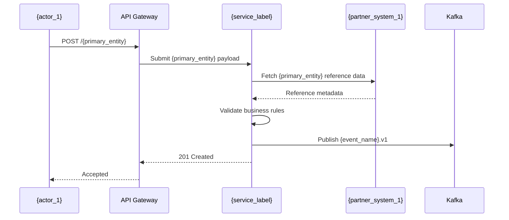
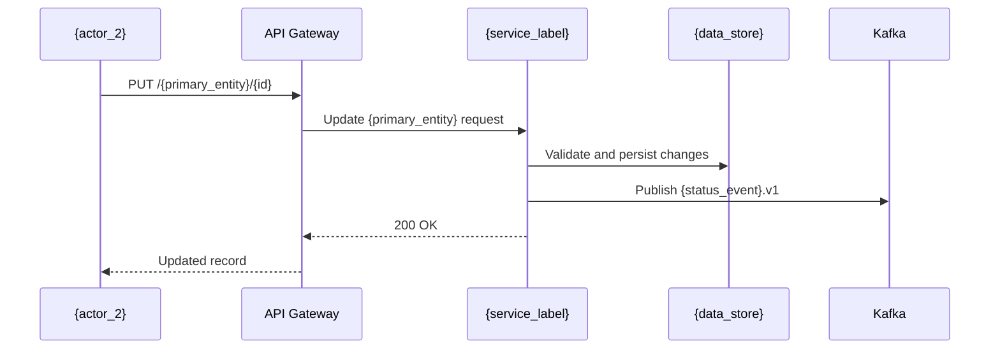
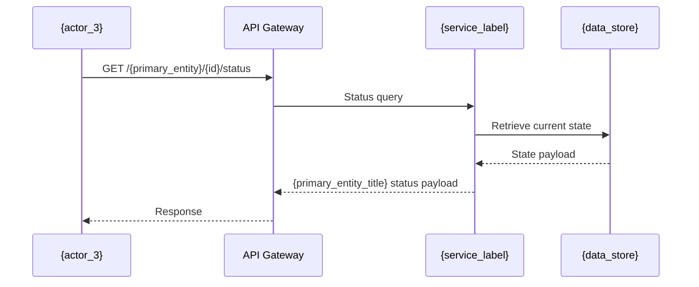
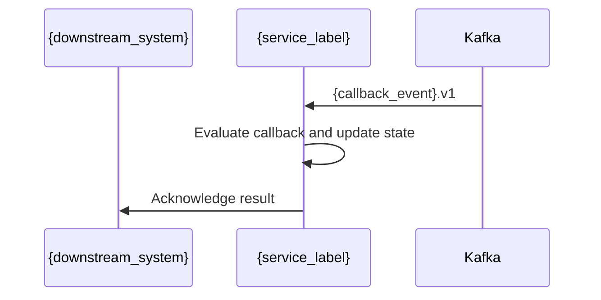

# {service_name}

## 1. Document Overview

### Purpose
{service_name} provides a unified API layer for {primary_entity} orchestration, partner interaction, and event propagation across the target workflow.

### Scope
#### In Scope
- {primary_entity_title} submission and lookup APIs
- {primary_entity_title} validation and status retrieval
- Event publication to downstream systems
- Integration with external partner systems

#### Out of Scope
- User authentication platform
- Reporting services
- Notification platform
- Separate workflow orchestration domain

## 2. Business Context

### Problem Statement
The target business workflow spans multiple internal systems and external partners, which creates fragmented visibility and delayed updates. {service_name} addresses this by consolidating {primary_entity} operations, validating the workflow, and publishing status events to downstream consumers.

### Business Capabilities Supported
| Capability | Description |
|---|---|---|
| {primary_entity_title} Lookup | Retrieve current state and metadata for the target business record |
| {primary_entity_title} Submission | Submit and validate the target workflow request |
| State Tracking | Query lifecycle or processing status |
| Partner Event Integration | Publish and consume callbacks and partner events |

## 3. Service Overview

### Service Responsibilities
- Create {primary_entity}
- Retrieve {primary_entity} details
- Validate {primary_entity} state transitions
- Publish business events
- Consume partner callbacks
- Enforce workflow validation rules

### Service Boundaries
#### Owned by Service
- {primary_entity_title} lifecycle data
- {primary_entity_title} APIs
- Business validation rules
- Event contracts

#### Not Owned
- Authentication
- Notification
- Separate workflow orchestration
- Reporting

## 4. Functional Architecture

This Complex integration (score 7) coordinates event-driven processing across three external systems using six Kafka topics: claim-status-updates, fraud-check-requests, fraud-check-callbacks, payment-status-updates, document-status-updates, and claim-submission-events. There are no APIs or named connectors, transformation complexity is none, and OAuth is the required security model; the estimated effort is 6-9 PM covering Kafka integrations, external-system integration, OAuth, testing, and hardening. EDA style: pub_sub. Test scope: Cover Kafka publish/consume flows, all external-system integrations, OAuth, contract tests, failure scenarios, and end-to-end integration..

```mermaid
flowchart LR
    Client([Consumer Apps]) --> GW[API Gateway]
    GW --> S[{service_name}]
    S --> V[Business Validation / Rules]
    V --> DB[({primary_entity_title} data store)]
    V --> K[Kafka Event Stream]
    K --> D[Partner & Downstream Systems]
```

## 5. API Design

### API Catalogue
| API | Method | Purpose |
|---|---|---|
| POST /claims | POST | Submit a new claim for adjudication |
| GET /claims/{id} | GET | Retrieve claim details |
| PUT /claims/{id} | PUT | Update claim information |
| GET /policies/{policyId} | GET | Look up policy details for a claim |
| POST /claims/{id}/submit | POST | Submit claim for adjudication |
| GET /claims/{id}/status | GET | Fetch current claim status |
| POST /claims/{id}/fraud-check | POST | Trigger fraud check callback flow |
| GET /claims/{id}/documents | GET | Fetch claim-related documents |
| POST /claims/{id}/documents | POST | Attach supporting documentary evidence |
| GET /partners/{partnerId}/status | GET | View partner integration status |
| POST /partners/{partnerId}/callbacks | POST | Accept partner event callback payloads |
| PATCH /claims/{id}/status | PATCH | Apply updated claim processing status |

### API 1: POST /claims

**Endpoint**
POST /claims

**Request**
```json
{
  "{primary_entity}_id": "{identifier_value}",
  "{reference_field}": "{reference_value}"
}
```

**Response**
```json
{
  "{primary_entity}_id": "{identifier_value}"
}
```

**Purpose**
Submit a new claim for adjudication

**Validations**
- The primary business identifier is required for all create/update operations
- Reference fields must map to valid external or internal system keys
- Status transitions must follow the target business workflow
- Search filters must not exceed the allowed maximum length

**Error Codes**
- 400 Bad Request
- 401 Unauthorized
- 404 Not Found
- 409 Conflict
- 500 Internal Server Error

### API 2: GET /claims/{id}

**Endpoint**
GET /claims/{id}

**Request**
```json
{
  "{primary_entity}_id": "{identifier_value}",
  "{reference_field}": "{reference_value}"
}
```

**Response**
```json
{
  "{primary_entity}_id": "{identifier_value}",
  "{reference_field}": "{reference_value}",
  "status": "submitted"
}
```

**Purpose**
Retrieve claim details

**Validations**
- The primary business identifier is required for all create/update operations
- Reference fields must map to valid external or internal system keys
- Status transitions must follow the target business workflow
- Search filters must not exceed the allowed maximum length

**Error Codes**
- 400 Bad Request
- 401 Unauthorized
- 404 Not Found
- 409 Conflict
- 500 Internal Server Error

### API 3: PUT /claims/{id}

**Endpoint**
PUT /claims/{id}

**Request**
```json
{
  "{primary_entity}_id": "{identifier_value}",
  "{reference_field}": "{reference_value}"
}
```

**Response**
```json
{
  "{primary_entity}_id": "{identifier_value}",
  "{reference_field}": "{reference_value}",
  "status": "submitted"
}
```

**Purpose**
Update claim information

**Validations**
- The primary business identifier is required for all create/update operations
- Reference fields must map to valid external or internal system keys
- Status transitions must follow the target business workflow
- Search filters must not exceed the allowed maximum length

**Error Codes**
- 400 Bad Request
- 401 Unauthorized
- 404 Not Found
- 409 Conflict
- 500 Internal Server Error

### API 4: GET /policies/{policyId}

**Endpoint**
GET /policies/{policyId}

**Request**
```json
{
  "{primary_entity}_id": "{identifier_value}",
  "{reference_field}": "{reference_value}"
}
```

**Response**
```json
{
  "{primary_entity}_id": "{identifier_value}",
  "status": "submitted"
}
```

**Purpose**
Look up policy details for a claim

**Validations**
- The primary business identifier is required for all create/update operations
- Reference fields must map to valid external or internal system keys
- Status transitions must follow the target business workflow
- Search filters must not exceed the allowed maximum length

**Error Codes**
- 400 Bad Request
- 401 Unauthorized
- 404 Not Found
- 409 Conflict
- 500 Internal Server Error

### API 5: POST /claims/{id}/submit

**Endpoint**
POST /claims/{id}/submit

**Request**
```json
{
  "{primary_entity}_id": "{identifier_value}",
  "{reference_field}": "{reference_value}"
}
```

**Response**
```json
{
  "{primary_entity}_id": "{identifier_value}",
  "{reference_field}": "{reference_value}",
  "status": "submitted"
}
```

**Purpose**
Submit claim for adjudication

**Validations**
- The primary business identifier is required for all create/update operations
- Reference fields must map to valid external or internal system keys
- Status transitions must follow the target business workflow
- Search filters must not exceed the allowed maximum length

**Error Codes**
- 400 Bad Request
- 401 Unauthorized
- 404 Not Found
- 409 Conflict
- 500 Internal Server Error

### API 6: GET /claims/{id}/status

**Endpoint**
GET /claims/{id}/status

**Request**
```json
{
  "{primary_entity}_id": "{identifier_value}",
  "includeHistory": true
}
```

**Response**
```json
{
  "{primary_entity}_id": "{identifier_value}",
  "status": "in_review"
}
```

**Purpose**
Fetch current claim status

**Validations**
- The primary business identifier is required for all create/update operations
- Reference fields must map to valid external or internal system keys
- Status transitions must follow the target business workflow
- Search filters must not exceed the allowed maximum length

**Error Codes**
- 400 Bad Request
- 401 Unauthorized
- 404 Not Found
- 409 Conflict
- 500 Internal Server Error

### API 7: POST /claims/{id}/fraud-check

**Endpoint**
POST /claims/{id}/fraud-check

**Request**
```json
{
  "{primary_entity}_id": "{identifier_value}",
  "{reference_field}": "{reference_value}"
}
```

**Response**
```json
{
  "{primary_entity}_id": "{identifier_value}",
  "{reference_field}": "{reference_value}",
  "status": "submitted"
}
```

**Purpose**
Trigger fraud check callback flow

**Validations**
- The primary business identifier is required for all create/update operations
- Reference fields must map to valid external or internal system keys
- Status transitions must follow the target business workflow
- Search filters must not exceed the allowed maximum length

**Error Codes**
- 400 Bad Request
- 401 Unauthorized
- 404 Not Found
- 409 Conflict
- 500 Internal Server Error

### API 8: GET /claims/{id}/documents

**Endpoint**
GET /claims/{id}/documents

**Request**
```json
{
  "{primary_entity}_id": "{identifier_value}",
  "{reference_field}": "{reference_value}"
}
```

**Response**
```json
{
  "{primary_entity}_id": "{identifier_value}",
  "{reference_field}": "{reference_value}",
  "status": "submitted"
}
```

**Purpose**
Fetch claim-related documents

**Validations**
- The primary business identifier is required for all create/update operations
- Reference fields must map to valid external or internal system keys
- Status transitions must follow the target business workflow
- Search filters must not exceed the allowed maximum length

**Error Codes**
- 400 Bad Request
- 401 Unauthorized
- 404 Not Found
- 409 Conflict
- 500 Internal Server Error

### API 9: POST /claims/{id}/documents

**Endpoint**
POST /claims/{id}/documents

**Request**
```json
{
  "{primary_entity}_id": "{identifier_value}",
  "{reference_field}": "{reference_value}"
}
```

**Response**
```json
{
  "{primary_entity}_id": "{identifier_value}",
  "{reference_field}": "{reference_value}",
  "status": "submitted"
}
```

**Purpose**
Attach supporting documentary evidence

**Validations**
- The primary business identifier is required for all create/update operations
- Reference fields must map to valid external or internal system keys
- Status transitions must follow the target business workflow
- Search filters must not exceed the allowed maximum length

**Error Codes**
- 400 Bad Request
- 401 Unauthorized
- 404 Not Found
- 409 Conflict
- 500 Internal Server Error

### API 10: GET /partners/{partnerId}/status

**Endpoint**
GET /partners/{partnerId}/status

**Request**
```json
{
  "{primary_entity}_id": "{identifier_value}",
  "includeHistory": true
}
```

**Response**
```json
{
  "{primary_entity}_id": "{identifier_value}",
  "status": "in_review"
}
```

**Purpose**
View partner integration status

**Validations**
- The primary business identifier is required for all create/update operations
- Reference fields must map to valid external or internal system keys
- Status transitions must follow the target business workflow
- Search filters must not exceed the allowed maximum length

**Error Codes**
- 400 Bad Request
- 401 Unauthorized
- 404 Not Found
- 409 Conflict
- 500 Internal Server Error

### API 11: POST /partners/{partnerId}/callbacks

**Endpoint**
POST /partners/{partnerId}/callbacks

**Request**
```json
{
  "{primary_entity}_id": "{identifier_value}",
  "{reference_field}": "{reference_value}"
}
```

**Response**
```json
{
  "{primary_entity}_id": "{identifier_value}"
}
```

**Purpose**
Accept partner event callback payloads

**Validations**
- The primary business identifier is required for all create/update operations
- Reference fields must map to valid external or internal system keys
- Status transitions must follow the target business workflow
- Search filters must not exceed the allowed maximum length

**Error Codes**
- 400 Bad Request
- 401 Unauthorized
- 404 Not Found
- 409 Conflict
- 500 Internal Server Error

### API 12: PATCH /claims/{id}/status

**Endpoint**
PATCH /claims/{id}/status

**Request**
```json
{
  "{primary_entity}_id": "{identifier_value}",
  "includeHistory": true
}
```

**Response**
```json
{
  "{primary_entity}_id": "{identifier_value}",
  "status": "in_review"
}
```

**Purpose**
Apply updated claim processing status

**Validations**
- The primary business identifier is required for all create/update operations
- Reference fields must map to valid external or internal system keys
- Status transitions must follow the target business workflow
- Search filters must not exceed the allowed maximum length

**Error Codes**
- 400 Bad Request
- 401 Unauthorized
- 404 Not Found
- 409 Conflict
- 500 Internal Server Error

## 6. Sequence Diagrams

### Submit Business Flow


### Update State Flow


### Query Status Flow


### Callback / Event Publication Flow


## 7. Data Model

### Entity Diagram
```mermaid
classDiagram
    class {primary_entity_title} {
        +String {primary_entity}_id
        +String {primary_entity}_reference
        +String status
    }
    class {primary_entity_title}Document {
        +String documentId
        +String {primary_entity}_id
        +String documentType
    }
    class PartnerEvent {
        +String eventId
        +String partnerId
        +String eventType
    }
    {primary_entity_title} "1" --> "*" {primary_entity_title}Document
    {primary_entity_title} "1" --> "*" PartnerEvent
```

### Database Tables
| Table | Purpose |
|---|---|---|
| {PRIMARY_ENTITY_TITLE} | Core business record |
| {PRIMARY_ENTITY_TITLE}_DOCUMENT | Supporting document metadata |
| EVENT_LOG | Event audit and traceability record |

## 8. Integration Design

### Downstream Systems
| System | Type |
|---|---|---|
| Core Data Store | Sync |
| Kafka | Async |
| External Partner Gateway | Async |

### Events Published
- {primary_entity_title}Submitted
- {primary_entity_title}StatusUpdated
- ExternalCallbackReceived

### Events Consumed
- PartnerStatusChanged
- DownstreamCallbackResult

### Kafka Topics / Event Contracts
| Topic | Purpose |
|---|---|---|
| claim-status-updates | Publishes asynchronous claim status changes, directly grounded in the document's 'async claim status updates' requirement. |
| fraud-check-requests | Carries asynchronous fraud-check work associated with claims to support the stated integration with the Fraud Detection Service and its fraud-check callbacks. |
| fraud-check-callbacks | Carries the explicitly stated 'fraud-check callbacks' from the Fraud Detection Service back into claims processing. |
| payment-status-updates | Provides asynchronous payment-related status events associated with the explicitly named Partner Payments Gateway integration and the stated claim-status update event layer. |
| document-status-updates | Provides asynchronous document-related status events associated with the explicitly named Document Vault integration and the stated claim-status update event layer. |
| claim-submission-events | Represents asynchronous claim lifecycle activity grounded in the documented claims-submission capability and the six-topic event-driven layer. |

## 9. Security Design

### Authentication
- OAuth2 client-credentials or equivalent service-to-service authentication
- API Gateway validates tokens before routing requests

### Authorization
- Role-based access control for operational and partner admin roles
- Least privilege for read vs write operations and callback handling

### Encryption
- TLS 1.2+ for all in-transit traffic
- Data encryption at rest
- Secret values stored in environment variables or managed vaults

### Audit Logging
- Capture create/update/delete operations
- Log event publication and system-level errors
- Retain audit trail for compliance and troubleshooting

## 10. Error Handling

| Error Code | Meaning |
|---|---|---|
| 400 | Bad Request |
| 401 | Unauthorized |
| 404 | Not Found |
| 409 | Conflict |
| 500 | Internal Error |

### Retry Strategy
- Retry transient downstream failures with backoff
- Do not retry non-idempotent operations without idempotency keys
- Dead-letter queue for asynchronous event delivery failures

## 11. Non-Functional Requirements

| Area | Requirement |
|---|---|---|
| Availability | 99.9% |
| Response Time | < 2 sec for standard read/update flows |
| TPS | 200/sec peak |
| Scalability | Horizontal scale-out across multiple pods |
| Logging | Centralized application and access logs |
| Observability | Metrics, distributed tracing, and health checks |

## 12. Deployment View

```mermaid
flowchart LR
    Ingress[Ingress / API Gateway] --> Pod1[{service_name} pod]
    Pod1 --> DB[({primary_entity_title} data store)]
    Pod1 --> Kafka[Kafka Cluster]
    Pod1 --> Partner[Partner Integration Layer]
```

### Deployment Notes
- Container image: {service_name}:latest
- Replica count: 3 minimum, scale based on traffic
- Resource sizing: 1 vCPU / 1-2 GB RAM per pod, plus storage per environment
- Horizontal scaling enabled for peak demand

## 13. Monitoring & Observability

- Application logs emitted in JSON format
- Metrics for latency, error rate, queue lag, and throughput
- Distributed tracing across API and Kafka boundaries
- Readiness and liveness health checks enabled
- Dashboard metrics for service health, resource usage, and business events

## 14. Assumptions
- All 3 external-system interfaces and test environments are documented and available.
- Kafka infrastructure and topic provisioning are handled by the platform team.
- OAuth identity provider, client registration, scopes, and credentials are available.
- Five topics remain simple and no message transformation is required.

## 15. Risks & Dependencies

| Risk | Mitigation |
|---|---|---|
| Downstream latency | Retry pattern with bounded exponential backoff |
| Kafka outage | DLQ and message replay strategy |
| Schema drift | Versioned event contracts and consumer validation |

### Risk Notes
- Kafka delivery guarantees are unspecified, creating duplicate or loss-handling uncertainty.
- Three external systems may introduce availability and interface-contract risks.
- OAuth token flows, scopes, or identity-provider configuration may delay integration.
- The moderate-complexity Kafka topic may require additional schema or processing work.

### Dependencies
- Kafka platform team for 6 topics, schemas, ACLs, and environments.
- Identity/security team for OAuth client registration, scopes, and credentials.
- Owners of all 3 external systems for contracts, connectivity, and test environments.
- CI/CD and runtime platform for Spring Boot service deployment and observability.

---

This HLD provides the core structure for engineering, validation, and integration teams to replace the placeholders with requirement-specific details.
