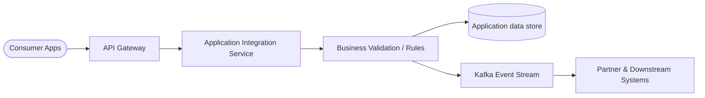
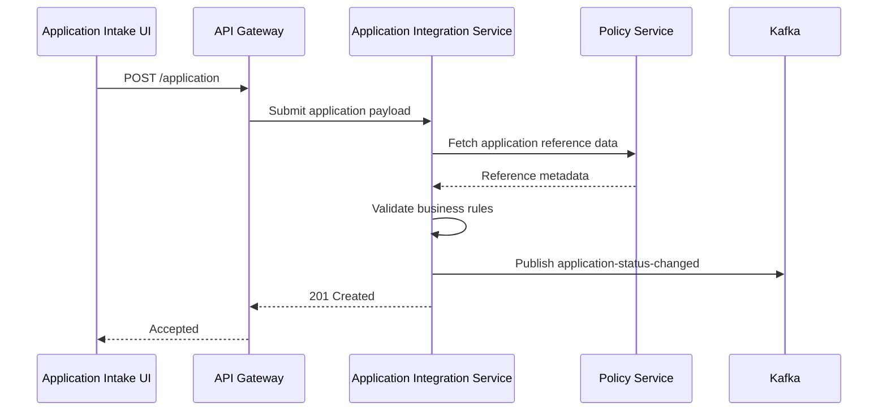
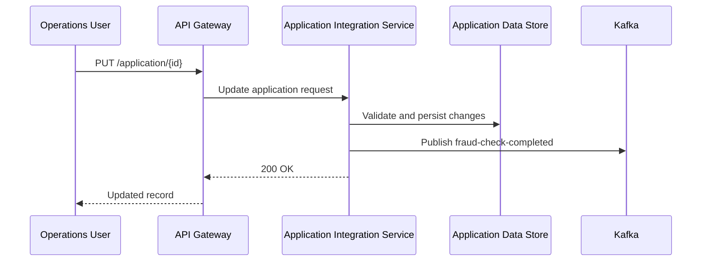
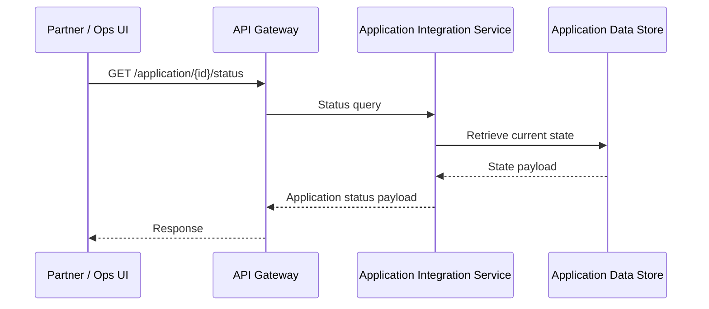
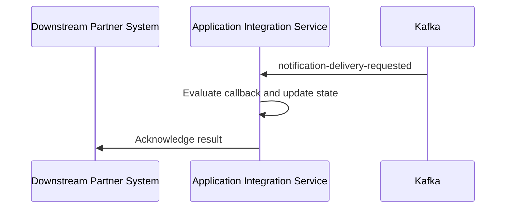
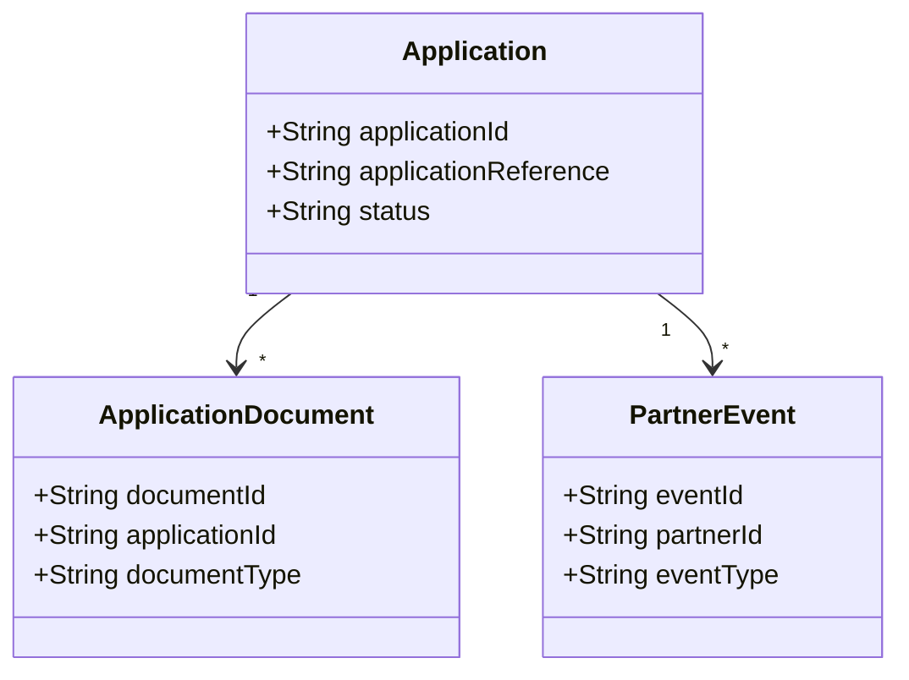
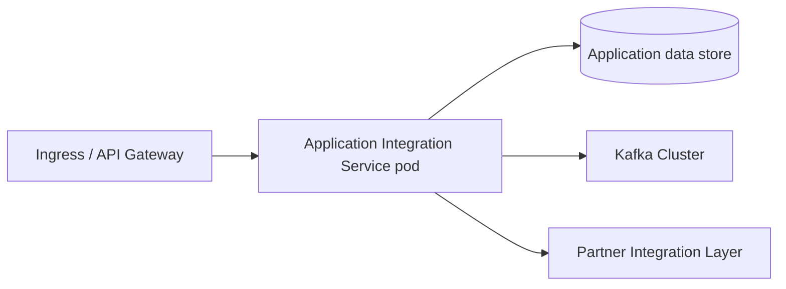

# Application Integration Service

## 1. Document Overview

### Purpose
Application Integration Service provides a unified API layer for application orchestration, partner interaction, and event propagation across the target workflow.

### Scope
#### In Scope
- Application submission and lookup APIs
- Application validation and status retrieval
- Event publication to downstream systems
- Integration with external partner systems

#### Out of Scope
- User authentication platform
- Reporting services
- Notification platform
- Separate workflow orchestration domain

## 2. Business Context

### Problem Statement
The target business workflow spans multiple internal systems and external partners, which creates fragmented visibility and delayed updates. Application Integration Service addresses this by consolidating application operations, validating the workflow, and publishing status events to downstream consumers.

### Business Capabilities Supported
| Capability | Description |
| --- | --- |
| Application Lookup | Retrieve current state and metadata for the target business record |
| Application Submission | Submit and validate the target workflow request |
| State Tracking | Query lifecycle or processing status |
| Partner Event Integration | Publish and consume callbacks and partner events |

## 3. Service Overview

### Service Responsibilities
- Create application
- Retrieve application details
- Validate application state transitions
- Publish business events
- Consume partner callbacks
- Enforce workflow validation rules

### Service Boundaries
#### Owned by Service
- Application lifecycle data
- Application APIs
- Business validation rules
- Event contracts

#### Not Owned
- Authentication
- Notification
- Separate workflow orchestration
- Reporting

## 4. Functional Architecture

This Complex integration (score 11) spans 12 application-focused APIs, 3 Kafka topics, and 5 external systems, using OAuth security and moderate transformation complexity to support application creation and updates, submission, document handling, status and assessment retrieval, decisions, and status updates. The estimated effort is 14-18 PM, reflecting the broad integration surface and several complex APIs, with Kafka supporting application status, fraud-check completion, and notification-delivery event flows. EDA style: pub_sub. Test scope: Cover API contracts, OAuth, transformations, Kafka flows, external-system integration, failure handling, and end-to-end regression..



## 5. API Design

### API Catalogue
| API | Method | Purpose |
| --- | --- | --- |
| POST /applications | POST | Starts a loan application and persists applicant/loan data, supporting the requirement that an applicant can "start, save, and resume a loan application"; integrates with the Core Banking Platform, where applicant and loan data currently lives. |
| PUT /applications/{applicationId} | PUT | Saves updates to an in-progress loan application so an applicant can save and later resume it; integrates with the Core Banking Platform. |
| GET /applications/{applicationId} | GET | Retrieves a saved loan application so the applicant can resume it, directly supporting the "start, save, and resume" requirement; reads applicant/loan data associated with the Core Banking Platform. |
| POST /applications/{applicationId}/submit | POST | Submits a completed application and initiates the underwriting flow described by "automatically pulls a credit report once an application is submitted" and fraud screening "before it reaches underwriting"; coordinates with the Credit Bureau Service and the event-driven fraud flow using Fraud Detection Service. |
| POST /applications/{applicationId}/documents | POST | Uploads pay stubs, ID, proof of address, or other supporting documents as required by the applicant portal; storage is expected to involve the Document Management System if the existing DMS option is selected. |
| GET /applications/{applicationId}/documents/{documentId} | GET | Retrieves an application document, consistent with the Document Management System integration whose stated purpose is to "store and retrieve signed loan agreements and disclosures." |
| GET /applications/{applicationId}/status | GET | Returns the application's current submitted, under-review, approved, declined, or funded status so applicants can "view real-time application status without calling support"; status changes also feed the application-status-changed Kafka flow. |
| GET /applications/{applicationId}/credit-result | GET | Retrieves the credit report and score needed for the underwriter dashboard after the system automatically pulls credit at submission; integrates with the Credit Bureau Service. |
| GET /applications/{applicationId}/fraud-result | GET | Retrieves the fraud-risk result required for the underwriter's side-by-side credit/fraud view; the result originates from the Fraud Detection Service and the fraud-check-completed Kafka flow. |
| GET /applications/{applicationId}/underwriting | GET | Provides the consolidated underwriting view required by "Underwriter can see credit and fraud results side by side before approving or declining," combining Credit Bureau Service and Fraud Detection Service results. |
| POST /applications/{applicationId}/decision | POST | Records the underwriter's approve or decline decision, matching the integration overview's explicit reference to "underwriter decisioning" and the requirement to approve or decline after reviewing credit and fraud results; approved processing can involve Core Banking Platform loan account creation. |
| POST /applications/{applicationId}/status | POST | Applies lifecycle status changes such as submitted, under review, approved, declined, or funded and initiates the automatic communications required on "every status change" through application-status-changed and notification-delivery-requested Kafka events to the SMS / Email Gateway. |

### API 1: POST /applications

**Endpoint**
POST /applications

**Request**
```json
{
  "applicationId": "CLM-1001",
  "applicationReference": "REF-1001"
}
```

**Response**
```json
{
  "applicationId": "CLM-1001",
  "status": "submitted"
}
```

**Purpose**
Starts a loan application and persists applicant/loan data, supporting the requirement that an applicant can "start, save, and resume a loan application"; integrates with the Core Banking Platform, where applicant and loan data currently lives.

**Validations**
- The primary business identifier is required for all create/update operations
- Reference fields must map to valid external or internal system keys
- Status transitions must follow the target business workflow
- Search filters must not exceed the allowed maximum length

**Error Codes**
- 400 Bad Request
- 401 Unauthorized
- 404 Not Found
- 409 Conflict
- 500 Internal Server Error

### API 2: PUT /applications/{applicationId}

**Endpoint**
PUT /applications/{applicationId}

**Request**
```json
{
  "applicationId": "CLM-1001",
  "applicationReference": "REF-1001"
}
```

**Response**
```json
{
  "applicationId": "CLM-1001",
  "status": "submitted"
}
```

**Purpose**
Saves updates to an in-progress loan application so an applicant can save and later resume it; integrates with the Core Banking Platform.

**Validations**
- The primary business identifier is required for all create/update operations
- Reference fields must map to valid external or internal system keys
- Status transitions must follow the target business workflow
- Search filters must not exceed the allowed maximum length

**Error Codes**
- 400 Bad Request
- 401 Unauthorized
- 404 Not Found
- 409 Conflict
- 500 Internal Server Error

### API 3: GET /applications/{applicationId}

**Endpoint**
GET /applications/{applicationId}

**Request**
```json
{
  "applicationId": "CLM-1001",
  "applicationReference": "REF-1001"
}
```

**Response**
```json
{
  "applicationId": "CLM-1001",
  "status": "submitted"
}
```

**Purpose**
Retrieves a saved loan application so the applicant can resume it, directly supporting the "start, save, and resume" requirement; reads applicant/loan data associated with the Core Banking Platform.

**Validations**
- The primary business identifier is required for all create/update operations
- Reference fields must map to valid external or internal system keys
- Status transitions must follow the target business workflow
- Search filters must not exceed the allowed maximum length

**Error Codes**
- 400 Bad Request
- 401 Unauthorized
- 404 Not Found
- 409 Conflict
- 500 Internal Server Error

### API 4: POST /applications/{applicationId}/submit

**Endpoint**
POST /applications/{applicationId}/submit

**Request**
```json
{
  "applicationId": "CLM-1001",
  "applicationReference": "REF-1001"
}
```

**Response**
```json
{
  "applicationId": "CLM-1001",
  "status": "submitted"
}
```

**Purpose**
Submits a completed application and initiates the underwriting flow described by "automatically pulls a credit report once an application is submitted" and fraud screening "before it reaches underwriting"; coordinates with the Credit Bureau Service and the event-driven fraud flow using Fraud Detection Service.

**Validations**
- The primary business identifier is required for all create/update operations
- Reference fields must map to valid external or internal system keys
- Status transitions must follow the target business workflow
- Search filters must not exceed the allowed maximum length

**Error Codes**
- 400 Bad Request
- 401 Unauthorized
- 404 Not Found
- 409 Conflict
- 500 Internal Server Error

### API 5: POST /applications/{applicationId}/documents

**Endpoint**
POST /applications/{applicationId}/documents

**Request**
```json
{
  "applicationId": "CLM-1001",
  "applicationReference": "REF-1001"
}
```

**Response**
```json
{
  "applicationId": "CLM-1001",
  "status": "submitted"
}
```

**Purpose**
Uploads pay stubs, ID, proof of address, or other supporting documents as required by the applicant portal; storage is expected to involve the Document Management System if the existing DMS option is selected.

**Validations**
- The primary business identifier is required for all create/update operations
- Reference fields must map to valid external or internal system keys
- Status transitions must follow the target business workflow
- Search filters must not exceed the allowed maximum length

**Error Codes**
- 400 Bad Request
- 401 Unauthorized
- 404 Not Found
- 409 Conflict
- 500 Internal Server Error

### API 6: GET /applications/{applicationId}/documents/{documentId}

**Endpoint**
GET /applications/{applicationId}/documents/{documentId}

**Request**
```json
{
  "applicationId": "CLM-1001",
  "applicationReference": "REF-1001"
}
```

**Response**
```json
{
  "applicationId": "CLM-1001",
  "status": "submitted"
}
```

**Purpose**
Retrieves an application document, consistent with the Document Management System integration whose stated purpose is to "store and retrieve signed loan agreements and disclosures."

**Validations**
- The primary business identifier is required for all create/update operations
- Reference fields must map to valid external or internal system keys
- Status transitions must follow the target business workflow
- Search filters must not exceed the allowed maximum length

**Error Codes**
- 400 Bad Request
- 401 Unauthorized
- 404 Not Found
- 409 Conflict
- 500 Internal Server Error

### API 7: GET /applications/{applicationId}/status

**Endpoint**
GET /applications/{applicationId}/status

**Request**
```json
{
  "applicationId": "CLM-1001",
  "applicationReference": "REF-1001",
  "includeHistory": true
}
```

**Response**
```json
{
  "applicationId": "CLM-1001",
  "status": "in_review"
}
```

**Purpose**
Returns the application's current submitted, under-review, approved, declined, or funded status so applicants can "view real-time application status without calling support"; status changes also feed the application-status-changed Kafka flow.

**Validations**
- The primary business identifier is required for all create/update operations
- Reference fields must map to valid external or internal system keys
- Status transitions must follow the target business workflow
- Search filters must not exceed the allowed maximum length

**Error Codes**
- 400 Bad Request
- 401 Unauthorized
- 404 Not Found
- 409 Conflict
- 500 Internal Server Error

### API 8: GET /applications/{applicationId}/credit-result

**Endpoint**
GET /applications/{applicationId}/credit-result

**Request**
```json
{
  "applicationId": "CLM-1001",
  "applicationReference": "REF-1001"
}
```

**Response**
```json
{
  "applicationId": "CLM-1001",
  "status": "submitted"
}
```

**Purpose**
Retrieves the credit report and score needed for the underwriter dashboard after the system automatically pulls credit at submission; integrates with the Credit Bureau Service.

**Validations**
- The primary business identifier is required for all create/update operations
- Reference fields must map to valid external or internal system keys
- Status transitions must follow the target business workflow
- Search filters must not exceed the allowed maximum length

**Error Codes**
- 400 Bad Request
- 401 Unauthorized
- 404 Not Found
- 409 Conflict
- 500 Internal Server Error

### API 9: GET /applications/{applicationId}/fraud-result

**Endpoint**
GET /applications/{applicationId}/fraud-result

**Request**
```json
{
  "applicationId": "CLM-1001",
  "applicationReference": "REF-1001"
}
```

**Response**
```json
{
  "applicationId": "CLM-1001",
  "status": "submitted"
}
```

**Purpose**
Retrieves the fraud-risk result required for the underwriter's side-by-side credit/fraud view; the result originates from the Fraud Detection Service and the fraud-check-completed Kafka flow.

**Validations**
- The primary business identifier is required for all create/update operations
- Reference fields must map to valid external or internal system keys
- Status transitions must follow the target business workflow
- Search filters must not exceed the allowed maximum length

**Error Codes**
- 400 Bad Request
- 401 Unauthorized
- 404 Not Found
- 409 Conflict
- 500 Internal Server Error

### API 10: GET /applications/{applicationId}/underwriting

**Endpoint**
GET /applications/{applicationId}/underwriting

**Request**
```json
{
  "applicationId": "CLM-1001",
  "applicationReference": "REF-1001"
}
```

**Response**
```json
{
  "applicationId": "CLM-1001",
  "status": "submitted"
}
```

**Purpose**
Provides the consolidated underwriting view required by "Underwriter can see credit and fraud results side by side before approving or declining," combining Credit Bureau Service and Fraud Detection Service results.

**Validations**
- The primary business identifier is required for all create/update operations
- Reference fields must map to valid external or internal system keys
- Status transitions must follow the target business workflow
- Search filters must not exceed the allowed maximum length

**Error Codes**
- 400 Bad Request
- 401 Unauthorized
- 404 Not Found
- 409 Conflict
- 500 Internal Server Error

### API 11: POST /applications/{applicationId}/decision

**Endpoint**
POST /applications/{applicationId}/decision

**Request**
```json
{
  "applicationId": "CLM-1001",
  "applicationReference": "REF-1001"
}
```

**Response**
```json
{
  "applicationId": "CLM-1001",
  "status": "submitted"
}
```

**Purpose**
Records the underwriter's approve or decline decision, matching the integration overview's explicit reference to "underwriter decisioning" and the requirement to approve or decline after reviewing credit and fraud results; approved processing can involve Core Banking Platform loan account creation.

**Validations**
- The primary business identifier is required for all create/update operations
- Reference fields must map to valid external or internal system keys
- Status transitions must follow the target business workflow
- Search filters must not exceed the allowed maximum length

**Error Codes**
- 400 Bad Request
- 401 Unauthorized
- 404 Not Found
- 409 Conflict
- 500 Internal Server Error

### API 12: POST /applications/{applicationId}/status

**Endpoint**
POST /applications/{applicationId}/status

**Request**
```json
{
  "applicationId": "CLM-1001",
  "applicationReference": "REF-1001",
  "includeHistory": true
}
```

**Response**
```json
{
  "applicationId": "CLM-1001",
  "status": "submitted"
}
```

**Purpose**
Applies lifecycle status changes such as submitted, under review, approved, declined, or funded and initiates the automatic communications required on "every status change" through application-status-changed and notification-delivery-requested Kafka events to the SMS / Email Gateway.

**Validations**
- The primary business identifier is required for all create/update operations
- Reference fields must map to valid external or internal system keys
- Status transitions must follow the target business workflow
- Search filters must not exceed the allowed maximum length

**Error Codes**
- 400 Bad Request
- 401 Unauthorized
- 404 Not Found
- 409 Conflict
- 500 Internal Server Error

## 6. Sequence Diagrams

### Submit Business Flow


### Update State Flow


### Query Status Flow


### Callback / Event Publication Flow


## 7. Data Model

### Entity Diagram


### Database Tables
| Table | Purpose |
| --- | --- |
| APPLICATION | Core business record |
| APPLICATION_DOCUMENT | Supporting document metadata |
| EVENT_LOG | Event audit and traceability record |

## 8. Integration Design

### Downstream Systems
| System | Type |
| --- | --- |
| Core Data Store | Sync |
| Kafka | Async |
| External Partner Gateway | Async |

### Events Published
- application-status-changed
- fraud-check-completed
- ExternalCallbackReceived

### Events Consumed
- notification-delivery-requested
- DownstreamCallbackResult

### Kafka Topics / Event Contracts
| Topic | Purpose |
| --- | --- |
| application-status-changed | Carries loan application status transitions such as submitted, under review, approved, declined, and funded; the document requires real-time status tracking and email/SMS notification on every status change. |
| fraud-check-completed | Carries completion/results of asynchronous fraud screening; the document requires every application to be screened for fraud before final approval, underwriters to see fraud results, and operations to be alerted for high-risk flags. |
| notification-delivery-requested | Requests asynchronous delivery through the SMS / Email Gateway when application status changes; the document requires an email and SMS notification on every status change. |
| claim.submitted.v1 | Claim submission event for adjudication |
| claim.status.updated.v1 | Claim status changes pushed to downstream systems |
| claim.fraud.check.requested.v1 | Fraud evaluation callback request |

## 9. Security Design

### Authentication
- OAuth2 client-credentials or equivalent service-to-service authentication
- API Gateway validates tokens before routing requests

### Authorization
- Role-based access control for operational and partner admin roles
- Least privilege for read vs write operations and callback handling

### Encryption
- TLS 1.2+ for all in-transit traffic
- Data encryption at rest
- Secret values stored in environment variables or managed vaults

### Audit Logging
- Capture create/update/delete operations
- Log event publication and system-level errors
- Retain audit trail for compliance and troubleshooting

## 10. Error Handling

| Error Code | Meaning |
| --- | --- |
| 400 | Bad Request |
| 401 | Unauthorized |
| 404 | Not Found |
| 409 | Conflict |
| 500 | Internal Error |

### Retry Strategy
- Retry transient downstream failures with backoff
- Do not retry non-idempotent operations without idempotency keys
- Dead-letter queue for asynchronous event delivery failures

## 11. Non-Functional Requirements

| Area | Requirement |
| --- | --- |
| Availability | 99.9% |
| Response Time | < 2 sec for standard read/update flows |
| TPS | 200/sec peak |
| Scalability | Horizontal scale-out across multiple pods |
| Logging | Centralized application and access logs |
| Observability | Metrics, distributed tracing, and health checks |

## 12. Deployment View



### Deployment Notes
- Container image: application-integration-service:latest
- Replica count: 3 minimum, scale based on traffic
- Resource sizing: 1 vCPU / 1-2 GB RAM per pod, plus storage per environment
- Horizontal scaling enabled for peak demand

## 13. Monitoring & Observability

- Application logs emitted in JSON format
- Metrics for latency, error rate, queue lag, and throughput
- Distributed tracing across API and Kafka boundaries
- Readiness and liveness health checks enabled
- Dashboard metrics for service health, resource usage, and business events

## 14. Assumptions
- External-system API contracts and test environments are stable and available.
- Kafka pub/sub requires no dead-letter handling or complex event orchestration.
- Moderate transformations can be implemented within Spring Boot services without a separate mapping platform.
- OAuth uses an existing enterprise identity provider and established security patterns.

## 15. Risks & Dependencies

| Risk | Mitigation |
| --- | --- |
| Downstream latency | Retry pattern with bounded exponential backoff |
| Kafka outage | DLQ and message replay strategy |
| Schema drift | Versioned event contracts and consumer validation |

### Risk Notes
- Unspecified Kafka delivery guarantees may create duplicate or lost-event handling gaps.
- Five external systems increase contract, environment, and coordination risk.
- Four complex APIs may require deeper orchestration, validation, or error handling.
- OAuth integration may introduce identity-provider and token-management constraints.

### Dependencies
- Five external-system owners must provide stable interfaces, credentials, and test environments.
- Kafka platform team must provision three topics and define delivery and retention settings.
- Identity provider team must configure OAuth clients, scopes, and required credentials.
- Platform team must provide Spring Boot deployment, observability, and CI/CD infrastructure.

---

This HLD provides the core structure for engineering, validation, and integration teams to replace the placeholders with requirement-specific details.
