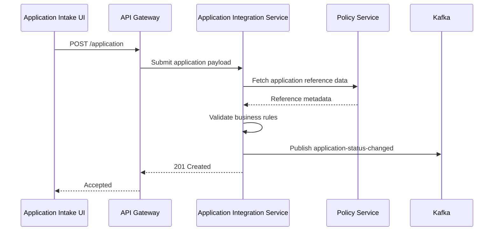
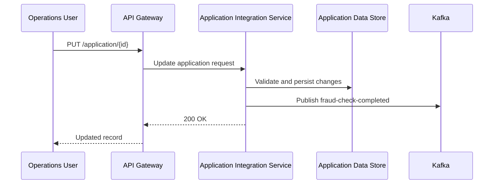
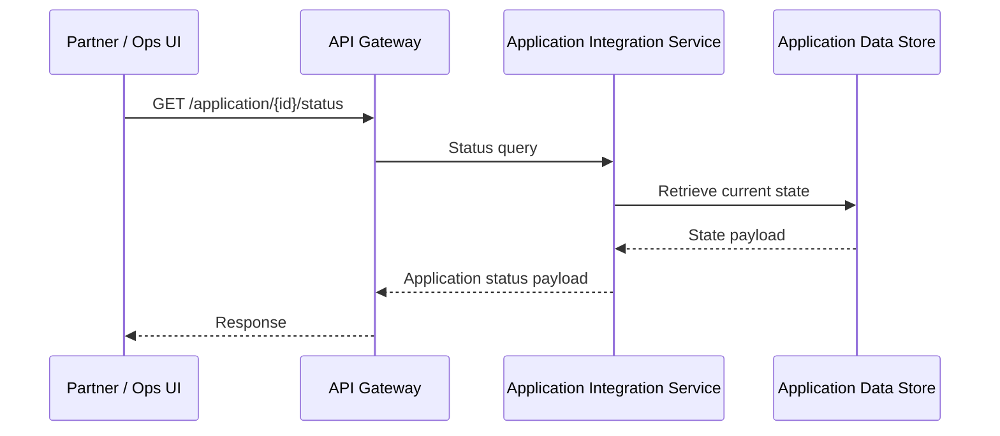
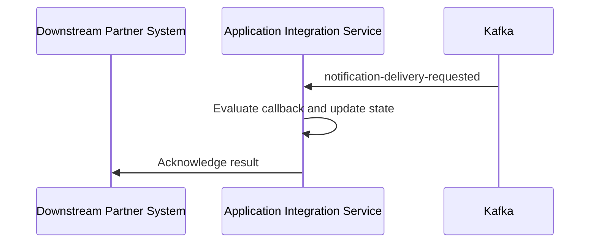
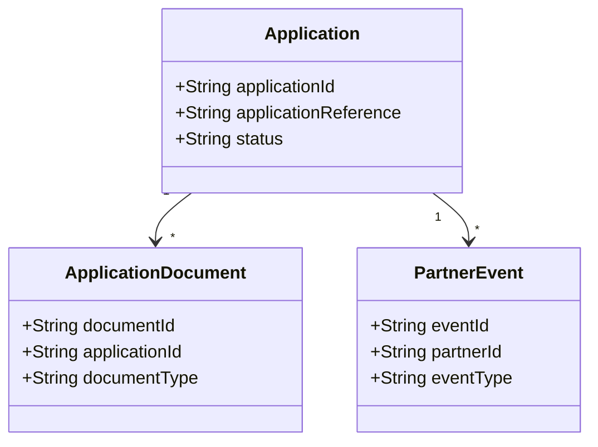
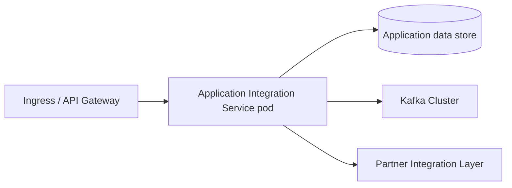

# Application Integration Service

## 1. Document Overview

### Purpose
Application Integration Service provides a unified API layer for application orchestration, partner interaction, and event propagation across the target workflow.

### Scope
#### In Scope
- Application submission and lookup APIs
- Application validation and status retrieval
- Event publication to downstream systems
- Integration with external partner systems

#### Out of Scope
- User authentication platform
- Reporting services
- Notification platform
- Separate workflow orchestration domain

## 2. Business Context

### Problem Statement
The target business workflow spans multiple internal systems and external partners, which creates fragmented visibility and delayed updates. Application Integration Service addresses this by consolidating application operations, validating the workflow, and publishing status events to downstream consumers.

### Business Capabilities Supported
| Capability | Description |
| --- | --- |
| Application Lookup | Retrieve current state and metadata for the target business record |
| Application Submission | Submit and validate the target workflow request |
| State Tracking | Query lifecycle or processing status |
| Partner Event Integration | Publish and consume callbacks and partner events |

## 3. Service Overview

### Service Responsibilities
- Create application
- Retrieve application details
- Validate application state transitions
- Publish business events
- Consume partner callbacks
- Enforce workflow validation rules

### Service Boundaries
#### Owned by Service
- Application lifecycle data
- Application APIs
- Business validation rules
- Event contracts

#### Not Owned
- Authentication
- Notification
- Separate workflow orchestration
- Reporting

## 4. Functional Architecture

This Complex integration (score 11) spans 12 application lifecycle APIs, three Kafka topics, and five external systems, covering application creation and updates, submission, documents, status, credit reporting, fraud results, underwriting, decisions, and status updates. The design must accommodate OAuth-secured interactions, moderate transformation complexity, and Kafka-based processing for application-status-changed, fraud-check-completed, and notification-delivery-requested, consistent with the 28-38 PD estimate driven by the broad integration surface and complexity. EDA style: pub_sub. Test scope: Cover API contracts, OAuth, transformations, Kafka flows, and end-to-end integration with all five external systems..


## 5. API Design

### API Catalogue
| API | Method | Purpose |
| --- | --- | --- |
| POST /applications | POST | Starts a loan application for the requirement that an applicant can "start, save, and resume a loan application"; persists applicant and loan data through the Core Banking Platform, whose internal schema is the current source for that data. |
| PUT /applications/{applicationId} | PUT | Saves updates to an in-progress application so the applicant can "start, save, and resume a loan application," using the Core Banking Platform for applicant and loan data. |
| GET /applications/{applicationId} | GET | Retrieves a saved loan application so an applicant can resume it, supporting the Applicant Portal requirement to "start, save, and resume" applications and reading loan/applicant data associated with the Core Banking Platform. |
| POST /applications/{applicationId}/submit | POST | Submits a completed application and initiates the document's required underwriting flow: automatic credit-report pull and fraud screening; it interacts with the Credit Bureau Service, Fraud Detection Service, and the event-driven layer. |
| POST /applications/{applicationId}/documents | POST | Supports the requirement that applicants can upload "pay stubs, ID, proof of address"; document persistence would use the Document Management System if the architecture open question resolves in favor of the existing system. |
| GET /applications/{applicationId}/documents/{documentId} | GET | Retrieves application documents, corresponding to document handling in the Applicant Portal and the Document Management System integration for storing and retrieving loan documents. |
| GET /applications/{applicationId}/status | GET | Provides the applicant-facing "real-time application status" for submitted, under review, approved, declined, or funded applications without requiring a support call. |
| GET /applications/{applicationId}/credit-report | GET | Retrieves the credit report and score needed for the requirement that the system automatically pulls credit data at submission and lets an underwriter see credit and fraud results side by side; it uses the Credit Bureau Service. |
| GET /applications/{applicationId}/fraud-result | GET | Retrieves the fraud risk result needed for underwriters to see fraud signals before approving or declining; the result originates from the Fraud Detection Service and fraud-check-completed event flow. |
| GET /applications/{applicationId}/underwriting | GET | Provides the underwriter dashboard's consolidated view so the underwriter can "see credit and fraud results side by side before approving or declining," combining Credit Bureau Service and Fraud Detection Service results. |
| POST /applications/{applicationId}/decision | POST | Records the underwriter's approve-or-decline decision described in the underwriting requirements and drives the resulting application status; approved processing can interact with the Core Banking Platform for loan account creation. |
| POST /applications/{applicationId}/status | POST | Records application transitions such as under review, approved, declined, and funded and supports the requirement for email and SMS on every status change through application-status-changed and notification-delivery-requested events consumed by the SMS / Email Gateway. |

### API 1: POST /applications

**Endpoint**
POST /applications

**Request**
```json
{
  "applicationId": "CLM-1001",
  "applicationReference": "REF-1001"
}
```

**Response**
```json
{
  "applicationId": "CLM-1001",
  "status": "submitted"
}
```

**Purpose**
Starts a loan application for the requirement that an applicant can "start, save, and resume a loan application"; persists applicant and loan data through the Core Banking Platform, whose internal schema is the current source for that data.

**Validations**
- The primary business identifier is required for all create/update operations
- Reference fields must map to valid external or internal system keys
- Status transitions must follow the target business workflow
- Search filters must not exceed the allowed maximum length

**Error Codes**
- 400 Bad Request
- 401 Unauthorized
- 404 Not Found
- 409 Conflict
- 500 Internal Server Error

### API 2: PUT /applications/{applicationId}

**Endpoint**
PUT /applications/{applicationId}

**Request**
```json
{
  "applicationId": "CLM-1001",
  "applicationReference": "REF-1001"
}
```

**Response**
```json
{
  "applicationId": "CLM-1001",
  "status": "submitted"
}
```

**Purpose**
Saves updates to an in-progress application so the applicant can "start, save, and resume a loan application," using the Core Banking Platform for applicant and loan data.

**Validations**
- The primary business identifier is required for all create/update operations
- Reference fields must map to valid external or internal system keys
- Status transitions must follow the target business workflow
- Search filters must not exceed the allowed maximum length

**Error Codes**
- 400 Bad Request
- 401 Unauthorized
- 404 Not Found
- 409 Conflict
- 500 Internal Server Error

### API 3: GET /applications/{applicationId}

**Endpoint**
GET /applications/{applicationId}

**Request**
```json
{
  "applicationId": "CLM-1001",
  "applicationReference": "REF-1001"
}
```

**Response**
```json
{
  "applicationId": "CLM-1001",
  "status": "submitted"
}
```

**Purpose**
Retrieves a saved loan application so an applicant can resume it, supporting the Applicant Portal requirement to "start, save, and resume" applications and reading loan/applicant data associated with the Core Banking Platform.

**Validations**
- The primary business identifier is required for all create/update operations
- Reference fields must map to valid external or internal system keys
- Status transitions must follow the target business workflow
- Search filters must not exceed the allowed maximum length

**Error Codes**
- 400 Bad Request
- 401 Unauthorized
- 404 Not Found
- 409 Conflict
- 500 Internal Server Error

### API 4: POST /applications/{applicationId}/submit

**Endpoint**
POST /applications/{applicationId}/submit

**Request**
```json
{
  "applicationId": "CLM-1001",
  "applicationReference": "REF-1001"
}
```

**Response**
```json
{
  "applicationId": "CLM-1001",
  "status": "submitted"
}
```

**Purpose**
Submits a completed application and initiates the document's required underwriting flow: automatic credit-report pull and fraud screening; it interacts with the Credit Bureau Service, Fraud Detection Service, and the event-driven layer.

**Validations**
- The primary business identifier is required for all create/update operations
- Reference fields must map to valid external or internal system keys
- Status transitions must follow the target business workflow
- Search filters must not exceed the allowed maximum length

**Error Codes**
- 400 Bad Request
- 401 Unauthorized
- 404 Not Found
- 409 Conflict
- 500 Internal Server Error

### API 5: POST /applications/{applicationId}/documents

**Endpoint**
POST /applications/{applicationId}/documents

**Request**
```json
{
  "applicationId": "CLM-1001",
  "applicationReference": "REF-1001"
}
```

**Response**
```json
{
  "applicationId": "CLM-1001",
  "status": "submitted"
}
```

**Purpose**
Supports the requirement that applicants can upload "pay stubs, ID, proof of address"; document persistence would use the Document Management System if the architecture open question resolves in favor of the existing system.

**Validations**
- The primary business identifier is required for all create/update operations
- Reference fields must map to valid external or internal system keys
- Status transitions must follow the target business workflow
- Search filters must not exceed the allowed maximum length

**Error Codes**
- 400 Bad Request
- 401 Unauthorized
- 404 Not Found
- 409 Conflict
- 500 Internal Server Error

### API 6: GET /applications/{applicationId}/documents/{documentId}

**Endpoint**
GET /applications/{applicationId}/documents/{documentId}

**Request**
```json
{
  "applicationId": "CLM-1001",
  "applicationReference": "REF-1001"
}
```

**Response**
```json
{
  "applicationId": "CLM-1001",
  "status": "submitted"
}
```

**Purpose**
Retrieves application documents, corresponding to document handling in the Applicant Portal and the Document Management System integration for storing and retrieving loan documents.

**Validations**
- The primary business identifier is required for all create/update operations
- Reference fields must map to valid external or internal system keys
- Status transitions must follow the target business workflow
- Search filters must not exceed the allowed maximum length

**Error Codes**
- 400 Bad Request
- 401 Unauthorized
- 404 Not Found
- 409 Conflict
- 500 Internal Server Error

### API 7: GET /applications/{applicationId}/status

**Endpoint**
GET /applications/{applicationId}/status

**Request**
```json
{
  "applicationId": "CLM-1001",
  "applicationReference": "REF-1001",
  "includeHistory": true
}
```

**Response**
```json
{
  "applicationId": "CLM-1001",
  "status": "in_review"
}
```

**Purpose**
Provides the applicant-facing "real-time application status" for submitted, under review, approved, declined, or funded applications without requiring a support call.

**Validations**
- The primary business identifier is required for all create/update operations
- Reference fields must map to valid external or internal system keys
- Status transitions must follow the target business workflow
- Search filters must not exceed the allowed maximum length

**Error Codes**
- 400 Bad Request
- 401 Unauthorized
- 404 Not Found
- 409 Conflict
- 500 Internal Server Error

### API 8: GET /applications/{applicationId}/credit-report

**Endpoint**
GET /applications/{applicationId}/credit-report

**Request**
```json
{
  "applicationId": "CLM-1001",
  "applicationReference": "REF-1001"
}
```

**Response**
```json
{
  "applicationId": "CLM-1001",
  "status": "submitted"
}
```

**Purpose**
Retrieves the credit report and score needed for the requirement that the system automatically pulls credit data at submission and lets an underwriter see credit and fraud results side by side; it uses the Credit Bureau Service.

**Validations**
- The primary business identifier is required for all create/update operations
- Reference fields must map to valid external or internal system keys
- Status transitions must follow the target business workflow
- Search filters must not exceed the allowed maximum length

**Error Codes**
- 400 Bad Request
- 401 Unauthorized
- 404 Not Found
- 409 Conflict
- 500 Internal Server Error

### API 9: GET /applications/{applicationId}/fraud-result

**Endpoint**
GET /applications/{applicationId}/fraud-result

**Request**
```json
{
  "applicationId": "CLM-1001",
  "applicationReference": "REF-1001"
}
```

**Response**
```json
{
  "applicationId": "CLM-1001",
  "status": "submitted"
}
```

**Purpose**
Retrieves the fraud risk result needed for underwriters to see fraud signals before approving or declining; the result originates from the Fraud Detection Service and fraud-check-completed event flow.

**Validations**
- The primary business identifier is required for all create/update operations
- Reference fields must map to valid external or internal system keys
- Status transitions must follow the target business workflow
- Search filters must not exceed the allowed maximum length

**Error Codes**
- 400 Bad Request
- 401 Unauthorized
- 404 Not Found
- 409 Conflict
- 500 Internal Server Error

### API 10: GET /applications/{applicationId}/underwriting

**Endpoint**
GET /applications/{applicationId}/underwriting

**Request**
```json
{
  "applicationId": "CLM-1001",
  "applicationReference": "REF-1001"
}
```

**Response**
```json
{
  "applicationId": "CLM-1001",
  "status": "submitted"
}
```

**Purpose**
Provides the underwriter dashboard's consolidated view so the underwriter can "see credit and fraud results side by side before approving or declining," combining Credit Bureau Service and Fraud Detection Service results.

**Validations**
- The primary business identifier is required for all create/update operations
- Reference fields must map to valid external or internal system keys
- Status transitions must follow the target business workflow
- Search filters must not exceed the allowed maximum length

**Error Codes**
- 400 Bad Request
- 401 Unauthorized
- 404 Not Found
- 409 Conflict
- 500 Internal Server Error

### API 11: POST /applications/{applicationId}/decision

**Endpoint**
POST /applications/{applicationId}/decision

**Request**
```json
{
  "applicationId": "CLM-1001",
  "applicationReference": "REF-1001"
}
```

**Response**
```json
{
  "applicationId": "CLM-1001",
  "status": "submitted"
}
```

**Purpose**
Records the underwriter's approve-or-decline decision described in the underwriting requirements and drives the resulting application status; approved processing can interact with the Core Banking Platform for loan account creation.

**Validations**
- The primary business identifier is required for all create/update operations
- Reference fields must map to valid external or internal system keys
- Status transitions must follow the target business workflow
- Search filters must not exceed the allowed maximum length

**Error Codes**
- 400 Bad Request
- 401 Unauthorized
- 404 Not Found
- 409 Conflict
- 500 Internal Server Error

### API 12: POST /applications/{applicationId}/status

**Endpoint**
POST /applications/{applicationId}/status

**Request**
```json
{
  "applicationId": "CLM-1001",
  "applicationReference": "REF-1001",
  "includeHistory": true
}
```

**Response**
```json
{
  "applicationId": "CLM-1001",
  "status": "submitted"
}
```

**Purpose**
Records application transitions such as under review, approved, declined, and funded and supports the requirement for email and SMS on every status change through application-status-changed and notification-delivery-requested events consumed by the SMS / Email Gateway.

**Validations**
- The primary business identifier is required for all create/update operations
- Reference fields must map to valid external or internal system keys
- Status transitions must follow the target business workflow
- Search filters must not exceed the allowed maximum length

**Error Codes**
- 400 Bad Request
- 401 Unauthorized
- 404 Not Found
- 409 Conflict
- 500 Internal Server Error

## 6. Sequence Diagrams

### Submit Business Flow


### Update State Flow


### Query Status Flow


### Callback / Event Publication Flow


## 7. Data Model

### Entity Diagram


### Database Tables
| Table | Purpose |
| --- | --- |
| APPLICATION | Core business record |
| APPLICATION_DOCUMENT | Supporting document metadata |
| EVENT_LOG | Event audit and traceability record |

## 8. Integration Design

### Downstream Systems
| System | Type |
| --- | --- |
| Core Data Store | Sync |
| Kafka | Async |
| External Partner Gateway | Async |

### Events Published
- application-status-changed
- fraud-check-completed
- ExternalCallbackReceived

### Events Consumed
- notification-delivery-requested
- DownstreamCallbackResult

### Kafka Topics / Event Contracts
| Topic | Purpose |
| --- | --- |
| application-status-changed | Carries loan application status transitions such as submitted, under review, approved, declined, and funded, supporting the requirement for real-time applicant status tracking and automatic email/SMS notification on every status change. |
| fraud-check-completed | Carries completion/results of the asynchronous fraud screening required to score each application before final approval and supports the operations alert when an application is flagged high-risk. |
| notification-delivery-requested | Requests delivery through the asynchronous SMS / Email Gateway, implementing the requirement that applicants receive email and SMS notifications whenever application status changes. |
| claim.submitted.v1 | Claim submission event for adjudication |
| claim.status.updated.v1 | Claim status changes pushed to downstream systems |
| claim.fraud.check.requested.v1 | Fraud evaluation callback request |

## 9. Security Design

### Authentication
- OAuth2 client-credentials or equivalent service-to-service authentication
- API Gateway validates tokens before routing requests

### Authorization
- Role-based access control for operational and partner admin roles
- Least privilege for read vs write operations and callback handling

### Encryption
- TLS 1.2+ for all in-transit traffic
- Data encryption at rest
- Secret values stored in environment variables or managed vaults

### Audit Logging
- Capture create/update/delete operations
- Log event publication and system-level errors
- Retain audit trail for compliance and troubleshooting

## 10. Error Handling

| Error Code | Meaning |
| --- | --- |
| 400 | Bad Request |
| 401 | Unauthorized |
| 404 | Not Found |
| 409 | Conflict |
| 500 | Internal Error |

### Retry Strategy
- Retry transient downstream failures with backoff
- Do not retry non-idempotent operations without idempotency keys
- Dead-letter queue for asynchronous event delivery failures

## 11. Non-Functional Requirements

| Area | Requirement |
| --- | --- |
| Availability | 99.9% |
| Response Time | < 2 sec for standard read/update flows |
| TPS | 200/sec peak |
| Scalability | Horizontal scale-out across multiple pods |
| Logging | Centralized application and access logs |
| Observability | Metrics, distributed tracing, and health checks |

## 12. Deployment View



### Deployment Notes
- Container image: application-integration-service:latest
- Replica count: 3 minimum, scale based on traffic
- Resource sizing: 1 vCPU / 1-2 GB RAM per pod, plus storage per environment
- Horizontal scaling enabled for peak demand

## 13. Monitoring & Observability

- Application logs emitted in JSON format
- Metrics for latency, error rate, queue lag, and throughput
- Distributed tracing across API and Kafka boundaries
- Readiness and liveness health checks enabled
- Dashboard metrics for service health, resource usage, and business events

## 14. Assumptions
- API and Kafka contracts are defined, versioned, and stable.
- OAuth provider, scopes, credentials, and token flows are available.
- Moderate transformations require no major custom mapping framework.
- No Kafka dead-letter handling is required as stated.

## 15. Risks & Dependencies

| Risk | Mitigation |
| --- | --- |
| Downstream latency | Retry pattern with bounded exponential backoff |
| Kafka outage | DLQ and message replay strategy |
| Schema drift | Versioned event contracts and consumer validation |

### Risk Notes
- Six complex APIs may introduce implementation and contract edge cases.
- Five external systems increase coordination, availability, and interface-change risk.
- Unspecified Kafka delivery guarantees could affect reliability and consumer behavior.
- OAuth configuration and authorization expectations may differ across integrations.

### Dependencies
- Five external systems must provide accessible environments and stable interfaces.
- OAuth identity provider and security configuration must be available.
- Kafka infrastructure and all three topic definitions must be provisioned.
- Upstream publishers and downstream consumers must agree event schemas and semantics.

---

This HLD provides the core structure for engineering, validation, and integration teams to replace the placeholders with requirement-specific details.
